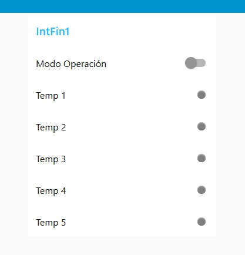
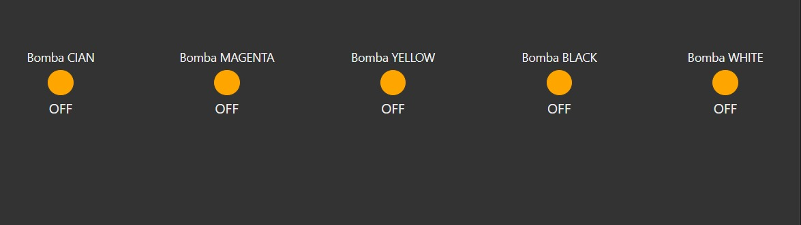
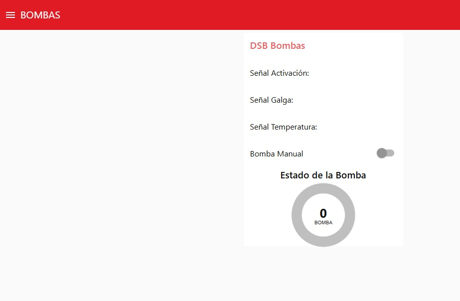
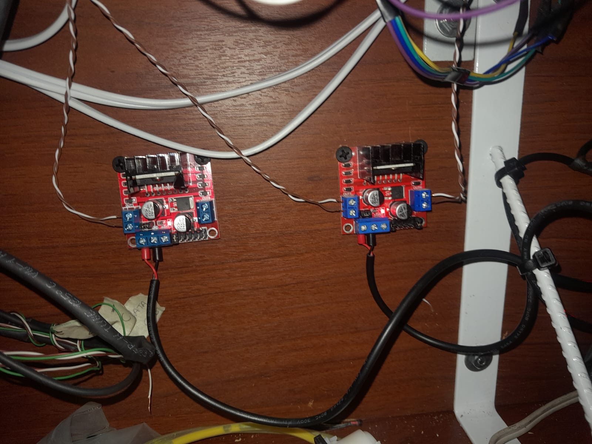
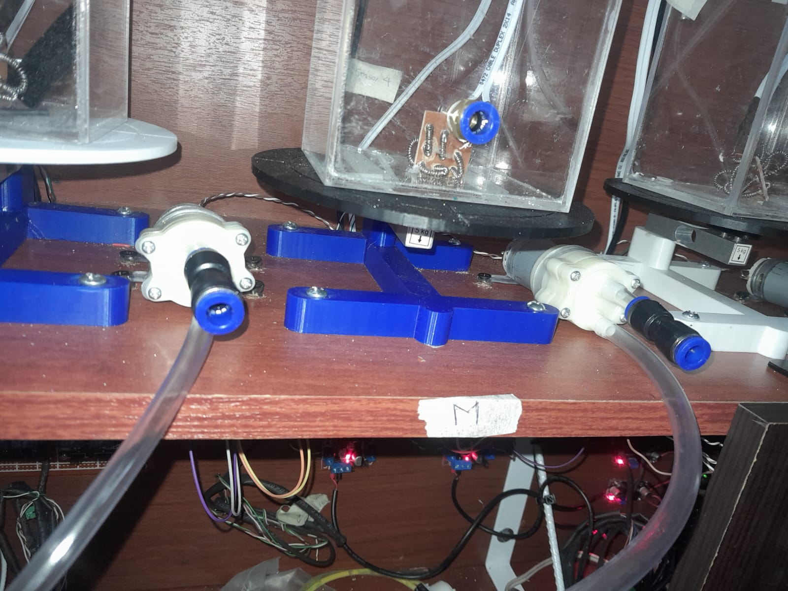
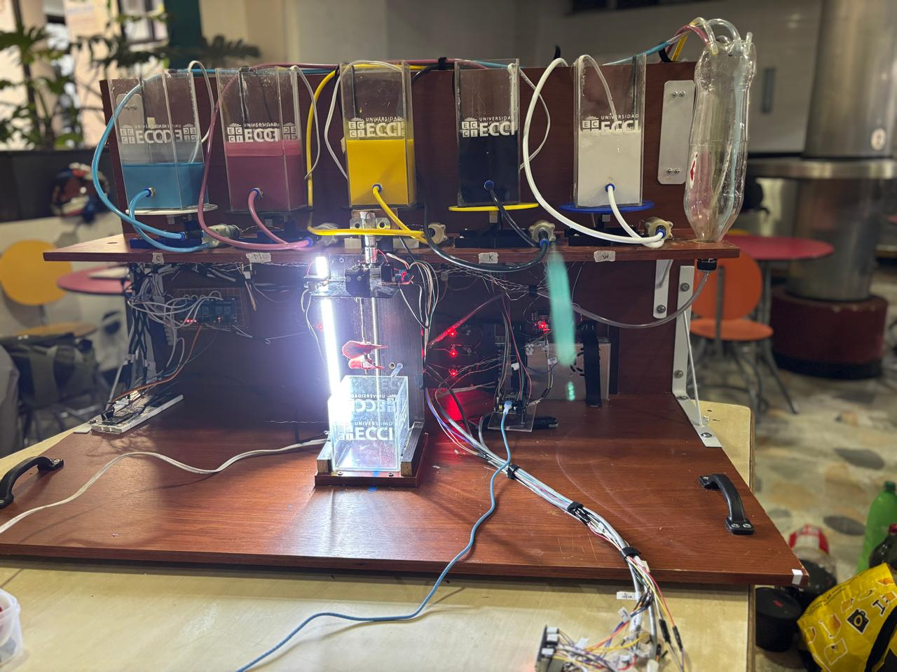

# AVANCES PROYECTO INTEGRADOR

# Nombre de la etapa: Bomba

## Integrantes

- [Michael Handrety Fonseca Arana](https://github.com/MichaelJF50)
- [Laura Daniela Rincón Pinilla](https://github.com/Laura03rincon)

## Documentación

En este proyecto se desarrolló un sistema de control automático para bombas peristálticas, utilizando un ESP32 y el protocolo MQTT.

El sistema permite dosificar con precisión las pinturas base: Cian (C), Magenta (M), Amarillo (Y), Negro (K) y Blanco (W), necesarias para obtener el color final deseado en el proceso de mezcla automatizada.

Por medio de la comunicación MQTT, las bombas pueden encenderse y apagarse desde una interfaz en Node-RED, mientras que el ESP32 recibe las proporciones de cada color y controla el tiempo de activación según la cantidad que se necesita dosificar.

Además, el sistema cuenta con una galga de carga que mide el peso del recipiente y detiene automáticamente las bombas cuando se alcanza el valor esperado.

### Objetivo

Diseñar e implementar un sistema de control para las bombas peristálticas encargadas de transferir las pinturas base (C, M, Y, K, W), utilizando un ESP32 conectado a un servidor MQTT, para lograr una dosificación automática, precisa y monitoreada en tiempo real.

# Funcionamiento General

## Inicio del proceso
- El usuario selecciona el color que desea dosificar.  
- Se envía un mensaje MQTT con el tema `bomba/inicio` y el valor `ON`.  
- El ESP32 enciende la bomba (salida en el pin configurado para el actuador).  
- El líquido fluye por el sistema hasta alcanzar el sensor correspondiente al color seleccionado.  

## Lectura de sensores
- Los sensores detectan la presencia del color mediante cambios en el valor de salida (S, M, Y, K, W).  
- Cada sensor envía su señal al ESP32, donde se procesa para determinar el momento exacto en el que debe detenerse la bomba.  
- Los valores se leen constantemente para garantizar precisión en la dosificación.

## Control del sistema
- El sistema trabaja con los parámetros S, M, Y, K y W, que representan los diferentes canales de color:  
  - **S:** Sensor de inicio o sincronización.  
  - **M:** Magenta.  
  - **Y:** Amarillo.  
  - **K:** Negro.  
  - **W:** Blanco o referencia.  
- El controlador evalúa las señales recibidas y ajusta el tiempo de activación de la bomba.  
- En caso de error o lectura fuera del rango esperado, se detiene el proceso automáticamente.

## Diagrama de Flujo del Sistema

A continuación se presenta el diagrama de flujo que describe el proceso completo de dosificación automática de tintas mediante bombas peristálticas.  
El objetivo de este diagrama es representar de forma visual la **secuencia lógica de control**, desde la lectura de temperatura y peso, hasta la mezcla final de los colores base.

<p align="center">
  
</p>

### Descripción del funcionamiento

1. **Inicio del proceso:**  
   El sistema inicia asignando el valor del color actual en 1, lo que corresponde al primer color base (por ejemplo, Cian).

2. **Lectura de temperatura de tinta:**  
   Se mide la temperatura del tanque de tinta correspondiente. Esta variable garantiza que la tinta tenga la viscosidad adecuada antes de ser bombeada.

3. **Verificación del rango de temperatura:**  
   - Si la temperatura **no está dentro del rango**, el sistema espera hasta que la tinta alcance la temperatura adecuada.  
   - Si la temperatura es correcta, continúa el proceso.

4. **Activación de la bomba:**  
   Se activa la bomba peristáltica del color actual.

5. **Lectura del peso del tanque principal:**  
   La galga de carga mide el peso para saber cuánto líquido se ha transferido.

6. **Control por peso objetivo:**  
   - Si el peso **no ha alcanzado** el valor objetivo, la bomba continúa.  
   - Si el peso **alcanza el valor esperado**, la bomba se detiene.

7. **Cambio de color:**  
   `color actual = color actual + 1`

8. **Verificación del número total de colores:**  
   - Si `color actual < 5`, se repite el proceso.  
   - Si se completan los cinco colores, el ciclo termina.

9. **Fin del proceso:**  
   Todas las bombas se detienen y la mezcla queda lista.

---

### Funcionalidad clave representada
- **Control de temperatura:** asegura una mezcla estable y homogénea.  
- **Medición de peso en tiempo real:** permite detener el flujo con precisión.  
- **Secuencia automática:** cada bomba se activa solo cuando la anterior finaliza.  
- **Verificación cíclica:** el proceso continúa hasta completar todas las tintas configuradas.  

---
## Resumen del ciclo de control

| Etapa | Descripción | Acción del sistema |
|--------|--------------|--------------------|
| Inicialización | Se define el color inicial (C) | Color actual = 1 |
| Lectura de temperatura | Sensor del tanque | Verifica rango |
| Bombeo | Bomba activa | Transfiere tinta |
| Control por peso | Galga de carga | Detiene bomba |
| Cambio de color | Siguiente tinta | Incrementa contador |
| Finalización | Último color completado | Proceso terminado |

---

## Comunicación MQTT

- El ESP32 se comunica con un servidor MQTT enviando y recibiendo datos en tiempo real.  
- Tópicos:  
  - `bomba/inicio`  
  - `sensor/S`, `sensor/M`, `sensor/Y`, `sensor/K`, `sensor/W`  
  - `estado/sistema`  

---

## Visualización y Monitoreo

- Panel MQTT / Node-RED con estados de sensores y bombas.  
- Vista en tiempo real del proceso de mezcla.  

---

### Node-RED: Explicación del último intento

En esta etapa se realizó el flujo final de Node-RED, el cual permite:

- Recibir los porcentajes ingresados por el usuario (C, M, Y, K, W).  
- Formar el mensaje en el formato requerido por el ESP32 (por ejemplo: `C:20 M:30 Y:10 K:40`).  
- Enviar el mensaje mediante MQTT al tema `esp/out`.  
- Mostrar el estado de cada bomba durante el proceso.  
- Visualizar los mensajes publicados por el ESP32 (ON, OFF, UP, DOWN) para verificar cada etapa del sistema.

### Componentes del flujo

- **Dashboard UI**  
- **Nodo function (crea el mensaje)**  
- **Nodo MQTT out**  
- **Nodo MQTT in**  
- **Indicadores del dashboard**  

### Flujo de funcionamiento

1. El usuario ingresa los porcentajes.  
2. Node-RED crea la cadena de texto.  
3. Se envía por MQTT.  
4. El ESP32 ejecuta la secuencia completa.  
5. Node-RED muestra el estado de cada etapa.

### Evidencia del flujo final

<p align="center">
  
</p>

<p align="center">
  
</p>

<p align="center">
  
</p>

---

## Variables Principales

| Variable        | Descripción                                       |
|-----------------|---------------------------------------------------|
| `sensor1`, `sensor2` | Entradas digitales nivel del tanque |
| `bomba`         | Control bomba |
| `led`           | Indica estado |
| `modo_manual`   | Manual/automático |
| `bomba_estado`  | ON / OFF |

---

## Explicación del código

Esta sección describe cómo funciona el código del ESP32 encargado de controlar la bomba peristáltica.
El programa está desarrollado en MicroPython, usando conexión WiFi, comunicación MQTT y control digital de entradas y salidas.

### Conexión WiFi

```python
SSID = "TIGO-E325"
PASSWORD = "7989956371"
```

- En esta parte del código se definen el nombre de la red WiFi (SSID) y la contraseña que el ESP32 utilizará para conectarse.

Esta conexión es indispensable, ya que sin acceso a la red local el dispositivo no podría comunicarse con el broker MQTT, que es el encargado de recibir y enviar los mensajes de control de la bomba.

### Configuración del broker MQTT

```python
BROKER = "192.168.1.9"
CLIENT_ID = "esp32_bomba"
TOPIC_BOMBA_CONTROL = b'bomba/control'
TOPIC_BOMBA_ESTADO = b'bomba/estado'
```

- Aquí se especifica la dirección IP del broker MQTT, al que el ESP32 debe conectarse para enviar y recibir datos.

- CLIENT_ID identifica al dispositivo dentro del servidor MQTT.

- Los tópicos (TOPIC_BOMBA_CONTROL y TOPIC_BOMBA_ESTADO) determinan los canales por donde se transmitirá la información.

- El tópico de control recibe comandos como ON, OFF o AUTO, mientras que el tópico de estado permite que el ESP32 informe si la bomba está activa o no.

### Callback MQTT

```python
def callback_mqtt(topic, msg):
    comando = msg.decode().strip().upper()

    if topic == TOPIC_BOMBA_CONTROL:
        if comando == "ON":
            encender_bomba()
        elif comando == "OFF":
            apagar_bomba()
        elif comando == "AUTO":
            modo_manual = False
```

- Esta función se ejecuta automáticamente cada vez que llega un mensaje desde el broker MQTT.

- Primero se convierte el mensaje a texto legible (decode) y se normaliza a mayúsculas.

- Según el comando recibido, el sistema decide si debe encender, apagar o pasar a modo automático.

- Esta función es el puente directo entre Node-RED (o cualquier cliente MQTT) y el actuador físico de la bomba.

### Control de la bomba

```python
def encender_bomba():
    bomba.value(1)
    led.value(1)
    client.publish(TOPIC_BOMBA_ESTADO, b"ON")

def apagar_bomba():
    bomba.value(0)
    led.value(0)
    client.publish(TOPIC_BOMBA_ESTADO, b"OFF")
```
- Estas funciones controlan directamente el pin del ESP32 que enciende o apaga la bomba peristáltica.

- Cuando la bomba se activa, también se enciende un LED que sirve como indicador visual del estado.

- Después de cambiar el estado físico, el ESP32 publica un mensaje informando a Node-RED si la bomba está en ON o en OFF, manteniendo el sistema sincronizado.

### Modo automático

```python
if not modo_manual:
    if sensor1.value() == 1 and sensor2.value() == 1:
        if not bomba_estado:
            encender_bomba()
    else:
        if bomba_estado:
            apagar_bomba()
```

- En esta parte se controla el funcionamiento automático del sistema según los valores de los sensores conectados.

- Si ambos sensores indican el nivel esperado, la bomba se enciende automáticamente.

- Si alguno cambia de estado (por ejemplo, se detecta que el tanque ya alcanzó el nivel deseado), la bomba se detiene inmediatamente.

- Este comportamiento evita derrames, errores de dosificación y garantiza que la mezcla siempre se mantenga dentro del rango especificado.

##  Video del funcionamiento

[Ver video en YouTube](https://youtube.com/shorts/XyB3JLqUIzM)

[Ver segundo video](https://youtube.com/shorts/PtICswtYfNs)

[Ver tercer video](https://youtube.com/shorts/ESgXuht2zm0)

[Ver cuarto video](https://youtube.com/shorts/nzPR5bZkEt8)

## Evidencias 

<p align="center">
  
</p>

<p align="center">
  
</p>

<p align="center">
  
</p>

<p align="center">
  
</p>

<p align="center">
  
</p>

<p align="center">
  
</p>

<p align="center">
  
</p>

<p align="center">
  
</p>


### Conclusiones

- Durante el desarrollo del sistema de bombeo se presentaron diversas dificultades relacionadas con el caudal, la viscosidad del vinilo y el paso no deseado de fluido, lo que obligó al equipo a realizar varias modificaciones técnicas tanto en la selección de bombas como en la mezcla utilizada.

- La implementación de Node-RED y la instalación física del sistema requirieron ajustes y soporte adicional, especialmente al migrar al servidor general y al integrar las mangueras, acoples y motores, lo que permitió afinar la operación del sistema.

- La solución más efectiva frente al flujo continuo no deseado fue la instalación de una cisterna elevada, lo cual permitió un control estable y preciso. A pesar de los cambios de cableado solicitados al final, el sistema logró cumplir con los requerimientos del proyecto y dejó aprendizajes importantes sobre integración y pruebas en campo.