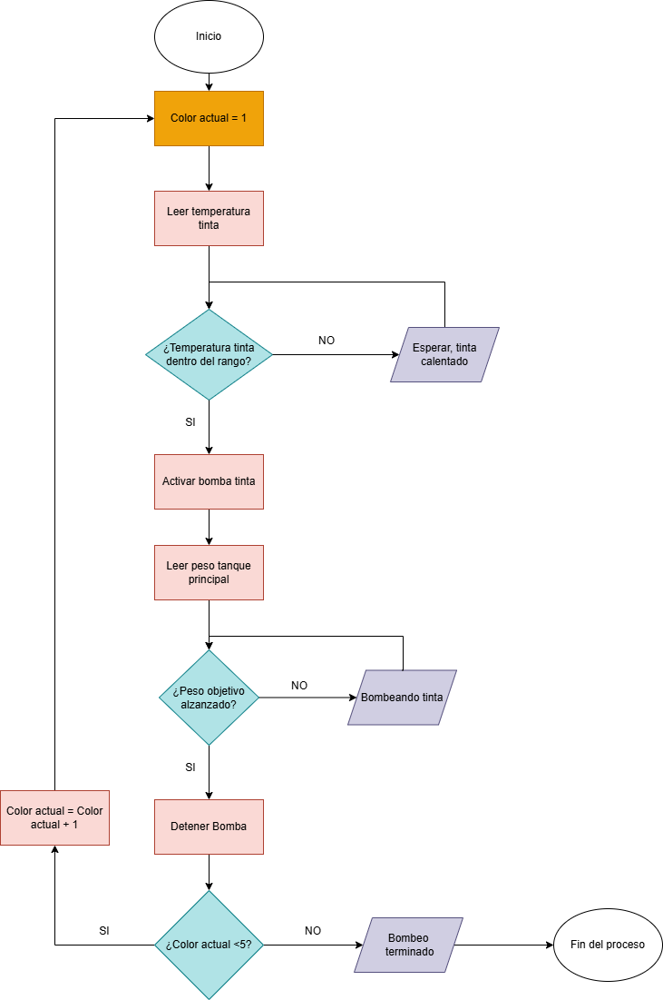
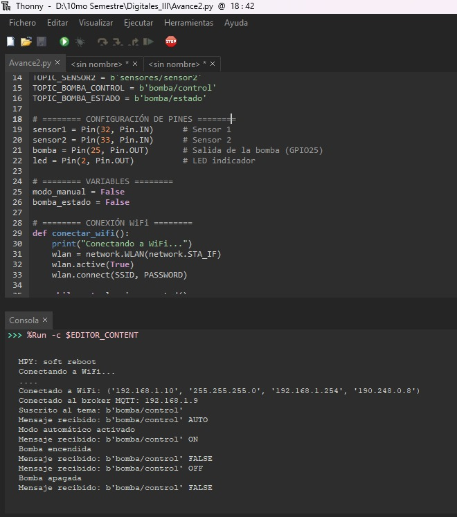

# AVANCES PROYECTO INTEGRADOR

## Integrantes

- [Michael Handrety Fonseca Arana](https://github.com/MichaelJF50)
- [Laura Daniela Rincón Pinilla](https://github.com/Laura03rincon)

## Documentación

En este proyecto se desarrolló un sistema de control automático para bombas peristálticas, utilizando un ESP32 y el protocolo MQTT.

El sistema permite dosificar con precisión las pinturas base: Cian (C), Magenta (M), Amarillo (Y), Negro (K) y Blanco (W), necesarias para obtener el color final deseado en el proceso de mezcla automatizada.

Por medio de la comunicación MQTT, las bombas pueden encenderse y apagarse desde una interfaz en Node-RED, mientras que el ESP32 recibe las proporciones de cada color y controla el tiempo de activación según la cantidad que se necesita dosificar.

Además, el sistema cuenta con una galga de carga que mide el peso del recipiente y detiene automáticamente las bombas cuando se alcanza el valor esperado.

### Objetivo

Diseñar e implementar un sistema de control para las bombas peristálticas encargadas de transferir las pinturas base (C, M, Y, K, W), utilizando un ESP32 conectado a un servidor MQTT, para lograr una dosificación automática, precisa y monitoreada en tiempo real.

# ⚙️ Funcionamiento General

## 🟢 Inicio del proceso
- El usuario selecciona el color que desea dosificar.  
- Se envía un mensaje MQTT con el tema `bomba/inicio` y el valor `ON`.  
- El ESP32 enciende la bomba (salida en el pin configurado para el actuador).  
- El líquido fluye por el sistema hasta alcanzar el sensor correspondiente al color seleccionado.  

## 🔵 Lectura de sensores
- Los sensores detectan la presencia del color mediante cambios en el valor de salida (S, M, Y, K, W).  
- Cada sensor envía su señal al ESP32, donde se procesa para determinar el momento exacto en el que debe detenerse la bomba.  
- Los valores se leen constantemente para garantizar precisión en la dosificación.

## 🟡 Control del sistema
- El sistema trabaja con los parámetros S, M, Y, K y W, que representan los diferentes canales de color:  
  - **S:** Sensor de inicio o sincronización.  
  - **M:** Magenta.  
  - **Y:** Amarillo.  
  - **K:** Negro.  
  - **W:** Blanco o referencia.  
- El controlador evalúa las señales recibidas y ajusta el tiempo de activación de la bomba.  
- En caso de error o lectura fuera del rango esperado, se detiene el proceso automáticamente.

## 🧭 Diagrama de Flujo del Sistema

A continuación se presenta el diagrama de flujo que describe el proceso completo de dosificación automática de tintas mediante bombas peristálticas.  
El objetivo de este diagrama es representar de forma visual la **secuencia lógica de control**, desde la lectura de temperatura y peso, hasta la mezcla final de los colores base.

  

### 🧩 Descripción del funcionamiento

1. **Inicio del proceso:**  
   El sistema inicia asignando el valor del color actual en 1, lo que corresponde al primer color base (por ejemplo, Cian).

2. **Lectura de temperatura de tinta:**  
   Se mide la temperatura del tanque de tinta correspondiente. Esta variable garantiza que la tinta tenga la viscosidad adecuada antes de ser bombeada.

3. **Verificación del rango de temperatura:**  
   - Si la temperatura **no está dentro del rango**, el sistema espera hasta que la tinta alcance la temperatura adecuada.  
   - Si la temperatura es correcta, continúa el proceso.

4. **Activación de la bomba:**  
   Una vez que la tinta está lista, se activa la **bomba peristáltica** asociada al color actual. El líquido comienza a fluir hacia el tanque principal.

5. **Lectura del peso del tanque principal:**  
   La galga de carga mide constantemente el peso del tanque principal para verificar el volumen transferido de tinta.

6. **Control por peso objetivo:**  
   - Si el peso **no ha alcanzado** el valor objetivo, el sistema mantiene activa la bomba.  
   - Si el peso **alcanza el valor esperado**, la bomba se detiene automáticamente.

7. **Cambio de color:**  
   El sistema incrementa el contador (`color actual = color actual + 1`) para continuar con el siguiente color base.

8. **Verificación del número total de colores:**  
   - Si aún quedan colores por dosificar (`color actual < 5`), el proceso se repite desde el paso 2.  
   - Si se han completado los cinco colores (C, M, Y, K, W), el proceso termina.

9. **Fin del proceso:**  
   El sistema detiene todas las bombas y finaliza el ciclo de mezcla.  
   En este punto, el tanque principal contiene la proporción deseada de los cinco colores base, lista para el uso o empaquetado.

---

### ⚙️ Funcionalidad clave representada
- **Control de temperatura:** asegura una mezcla estable y homogénea.  
- **Medición de peso en tiempo real:** permite detener el flujo con precisión.  
- **Secuencia automática:** cada bomba se activa solo cuando la anterior finaliza.  
- **Verificación cíclica:** el proceso continúa hasta completar todas las tintas configuradas.  

---

## 📊 Resumen del ciclo de control

| Etapa | Descripción | Acción del sistema |
|--------|--------------|--------------------|
| Inicialización | Se define el color inicial (C) | Color actual = 1 |
| Lectura de temperatura | Sensor lee el tanque de tinta | Verifica rango de temperatura |
| Bombeo | Bomba activa según color | Transfiere tinta al tanque principal |
| Control por peso | Galga monitorea peso objetivo | Detiene bomba al alcanzar el valor |
| Cambio de color | Incremento de variable de color | Repite proceso para siguiente tinta |
| Finalización | Último color completado | Proceso de mezcla finalizado |

## 🔴 Comunicación MQTT
- El ESP32 se comunica con un servidor MQTT que recibe y envía los datos en tiempo real.  
- Los tópicos principales utilizados son:  
  - `bomba/inicio`: activa o detiene la bomba.  
  - `sensor/S`, `sensor/M`, `sensor/Y`, `sensor/K`, `sensor/W`: envían los valores de los sensores.  
  - `estado/sistema`: reporta el estado general (activo, detenido, error).  
- Esta comunicación permite visualizar el estado del proceso desde cualquier dispositivo conectado a la red.

## ⚪ Visualización y monitoreo
- Los datos se pueden observar desde un panel MQTT o una interfaz desarrollada en Node-RED.  
- El sistema muestra el estado de los sensores y la bomba en tiempo real.  
- Esto permite verificar si la mezcla de colores y la cantidad dosificada son correctas.

## 🔩 Variables Principales

| Variable        | Descripción                                       |
|-----------------|---------------------------------------------------|
| `sensor1`, `sensor2` | Entradas digitales conectadas al nivel del tanque |
| `bomba`         | Salida digital para el control de la bomba        |
| `led`           | LED indicador de estado de la bomba               |
| `modo_manual`   | Indica si el control es manual o automático       |
| `bomba_estado`  | Estado actual de la bomba (ON / OFF)              |

## 📹 Video del funcionamiento

[

[

## 📸 Evidencias del Montaje

  

  

  

