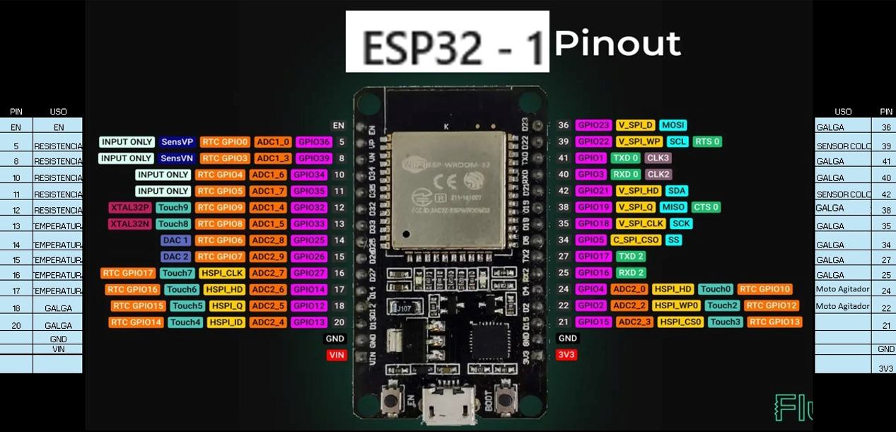
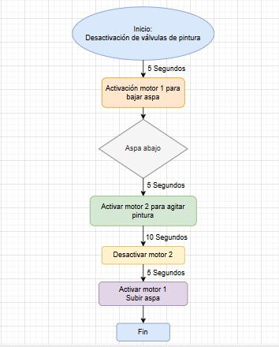

# Nombre de la etapa:

## Integrantes

Giselle Puentes Piñeros 31594  
Juan Pablo Ramirez 103681  
Nicolas Quiroga 109393  

## Documentación

El objetivo de este avance del proyecto es implementar un sistema de control automático para un motor agitador mediante el uso de dos motores eléctricos, una Raspberry Pi Pico 2 y una ESP32.
El primer motor se encarga de bajar y subir la hélice mezcladora, mientras que el segundo motor realiza la agitación de la pintura dentro de la cabina.
La coordinación de ambos motores se realiza de forma secuencial según el flujo de operación establecido, garantizando un proceso automatizado, preciso y eficiente.
Los motores son controlados a través de los pines GPIO2 y GPIO4 de la ESP32, con el apoyo de módulos puente H que permiten invertir el sentido de giro, y convertidores DC-DC Step-Down (Buck Converter) ajustables que regulan el voltaje de alimentación de cada motor.

  

## Herramientas utilizadas

Raspberry Pi Pico 2: microcontrolador principal encargado de gestionar la lógica de control y los tiempos de activación de los motores.

ESP32: microcontrolador auxiliar encargado de recibir y enviar señales de control mediante comunicación con la Pico 2; utiliza los pines GPIO2 y GPIO4 para activar los módulos puente H.

Motores DC (2 unidades):
Motor 1: encargado del movimiento vertical del aspa (bajar/subir).  
Motor 2: encargado de realizar la mezcla de pintura.  

Módulos Puente H: permiten controlar el sentido de giro y la activación de los motores mediante las señales de la ESP32.

Convertidores DC-DC Step-Down (Buck Converter): utilizados para ajustar el voltaje de alimentación de los motores, garantizando estabilidad y protección del sistema.

Software: Thonny IDE (para programación de la Pico y ESP32) y Node-RED o MQTT Broker (para monitoreo y control remoto del sistema).

### 1. [Flujos](/G02/flujos/flows.json)

El sistema sigue la siguiente secuencia de funcionamiento:  

Inicio: el proceso comienza una vez se detecta la desactivación de las válvulas de pintura.  
Retraso de seguridad (5 segundos) para asegurar que no haya residuos líquidos en movimiento.  
Activación del Motor 1: el aspa desciende hasta llegar a la posición inferior.  
Verificación de posición “Aspa abajo”.  
Activación del Motor 2: se inicia la agitación de la pintura durante 10 segundos.  
Desactivación del Motor 2.  
Retraso de seguridad (5 segundos).  
Activación del Motor 1 en sentido inverso: el aspa asciende a su posición inicial.  
Fin del proceso.  

## 2. Avances Node-red

  
  

### 3. Diseño digital montaje final

  
  
  

## 4. Diseño moto agitador fisico

## 5. Video de funcionamiento

