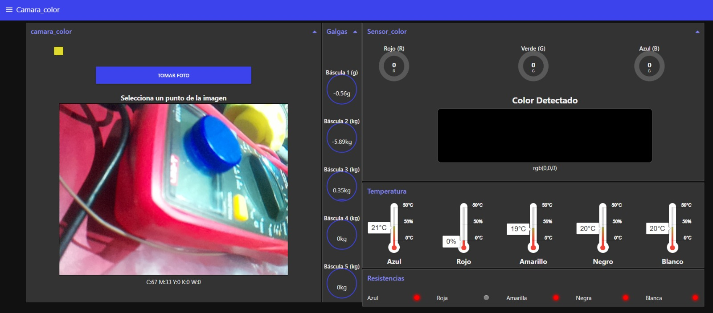
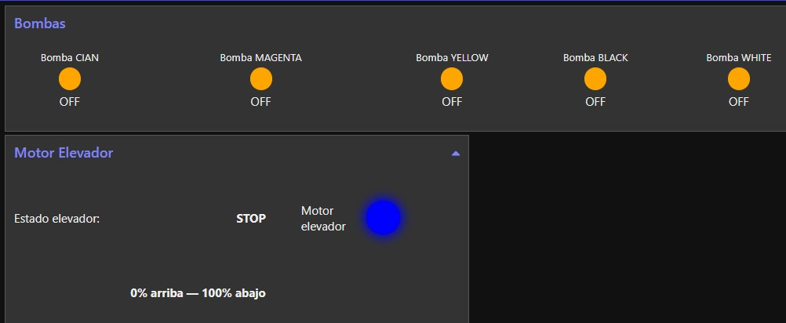

## Integración del Dashboard Interactivo en Node-RED para Supervisión y Control (IoT) del proyecto Mezclador de pintura 

# Integrantes

[1. Jesus Zuluaga](https://github.com/zuluagajesus973-hub)

[2. Kevin Vivas](https://github.com/Kevin-Vivas)

[3. Sebastian Bonza]() 

### Resumen
Este documento presenta el diseño, construcción e integración del dashboard IoT realizado en Node-RED para el sistema Mezclador de Pintura.
El dashboard permite supervisar sensores, visualizar cámaras, controlar actuadores remotos, administrar válvulas, bombas, sensores RGB, sensores de temperatura, módulos ESP32 y flujos MQTT.

También se documentan los problemas encontrados durante la implementación, junto con las soluciones aplicadas y consideraciones importantes para lograr un sistema estable.
El enfoque de este informe se mantiene en el dashboard, su arquitectura, su integración y su comportamiento dentro del ecosistema IoT.

## Índice
1.	Introducción
2.	Objetivos
3.	Arquitectura General
4.	Metodología

    * Procedimiento
    * Problemas Encontrados
    * Soluciones Aplicadas
    * Consideraciones Importantes
5.	Diseño del Dashboard
    * Estructura de pestañas
    * Widgets utilizados
    * Integración MQTT
6.	Resultados
7.	Conclusiones

## 1. Introducción
Node-RED se utilizó como plataforma principal para la creación del dashboard que permite visualizar datos provenientes de múltiples dispositivos ESP32, controlar procesos remotos y validar la correcta comunicación con el broker MQTT.
El dashboard facilita la depuración funcional del sistema IoT y la verificación del flujo de datos en tiempo real.

## 2. Objetivos
* Diseñar una interfaz gráfica funcional y clara para el monitoreo.
* Integrar el dashboard con el broker MQTT (tópicos IN/OUT).
* Validar la comunicación entre ESP32-1 y ESP32-2 mediante reenvío de mensajes.
* Mostrar estado, logs y diagnósticos para facilitar depuración.
* Organizar paneles visuales para sensores, cámaras y control... etc.

## 3. Arquitectura General
El flujo se compone de tres bloques esenciales:
1.	Entrada (MQTT-IN)
Recepción de datos desde tópicos como:

    * ```Camara/pi```
    * ``` in/esp1/temperatura/...```
    * ``` color/esp32```
    * ``` galga/color```
    * ``` mezclador```
    
2. Procesamiento (Node-RED)

    * Decodificación de imágenes
    * Separación de datos RGB
    * Conversión de temperatura
    * Lógica de control para mezclador
    * Control de válvulas y bombas
    * Mostrar estados en widgets
3.	Salida (MQTT-OUT)
Publicación hacia dispositivos (ej. `esp2/out`, `esp1/in`).
<!-- Aquí insertar DIAGRAMA ARQUITECTURA --> 

## 4. Metodología
4.1 Procedimiento

1.	Instalación de Node-RED
    *	Instalación en Raspberry Pi. [Intalacion de Node-RED](https://github.com/DianaNatali/ECCI-Sistemas-Digitales-3-2025-II/blob/main/labs/04_lab04/README.md)
2.	Configuración del broker MQTT
    * Uso de Mosquitto local. [Mosquito y MQTT](https://github.com/DianaNatali/ECCI-Sistemas-Digitales-3-2025-II/blob/main/labs/05_lab05/README.md)
    * Uso de Mosquitto local o túnel ngrok TCP. [Procedimiento tuneles ngrok](https://github.com/ECCI-Sistemas-Digitales-3/proyecto-integrador-final-2025-ii-sd3-g01-todos/tree/main/Servidor_central)
3.	Diseño de las pestañas del dashboard
   Cada módulo recibió una pestaña propia:

    * Cámara_color
    (visualización de frame y diagnóstico de conexión) [Camara_color](https://github.com/ECCI-Sistemas-Digitales-3/proyecto-integrador-final-2025-ii-sd3-g01-todos/tree/main/G04)
    * Sensor de Color
    Donde se reciben los valores RGB, se dividen y se agrupan.
    * TemperaturaSensor
    Se muestran las temperaturas por color y su respectiva resistencia (ON/OFF).
    * GALGA
    Lectura del peso y control asociado.
    * Mezclador
    Control del proceso de mezcla.
    * Bombas
    Encendido/apagado, tiempos y control del sistema de llenado.

4.	Integración de nodos clave
    * mqtt `in/out`
    * function (cálculos de RGB, lógica por color, etc.)
    * `ui_text`, `ui_gauge`, `ui_led`, `ui_button`, `ui_switch`
    * Nodos image para cámara

5.	Implementación del reenvío esp2 → esp1
    *	Lectura del tópico `esp/out`
    *	Visualización en dashboard
    *	Publicación hacia `esp1/in`
    Esto nos permitió comprobar si realmente la esp32 estaba enviando datos.

4.2 Problemas Encontrados

| Problema | Causa | Impacto |
|----------|--------|---------|
| No aparecía la cámara en el dashboard | La cámara estaba desconectada o mal inicializada en Raspberry | No se actualizaban frames |
| No llegaban mensajes desde esp | Error en el suscriptor MQTT o en el nombre del tópic | Reenvío esp2→esp1 fallaba |
| Ngrok no abría el túnel | Error en puerto o servicio detenido en Pi | No se podía acceder externamente |
| Node-RED no cargaba imágenes | Ruta incorrecta en widgets | Faltaban elementos visuales |

4.3 Soluciones Aplicadas

* Reinstalación de node-red-dashboard.
* Corrección de todos los tópicos (`esp1/in`, `esp2/out`, etc.).
* Revisión física de la cámara (conector CSI).
* Reinicio de la Raspberry después de conectar el módulo.
* Verificación del servicio Mosquitto y túnel ngrok activo.

4.4 Cosas Importantes a Tener en Cuenta

* Los tópicos deben estar correctamente escritos:
mayúsculas/minúsculas cambian totalmente el comportamiento.
* Ngrok cambia de puerto cada vez si no se usa token autenticado.
* La ESP32 debe reconectarse si el broker cambia de IP o puerto.
* Cuando publiques imágenes en el dashboard, Node-RED solo acepta rutas accesibles desde `/home/pi/.node-red/public/`.

## 5. Diseño del Dashboard
5.1 Estructura del Dashboard

    *  	Inicio → Estado del sistema, logs rápidos.
    •	ESP32-1 → Sensores, switches, comandos.
    •	ESP32-2 → Estado, controles remotos, depuración.
    •	Cámara → Frame actual, información de captura.
    •	Registros → Historial de mensajes recibidos y enviados.


5.2 Widgets Utilizados

Widget	Uso

`ui_text`	Mostrar mensajes de esp2/out
`ui_gauge`	Sensores (temp, distancia, etc.)
`ui_image`	Mostrar fotografías de cámara
`ui_button`	Control manual

`ui_switch`	Encendido/apagado de actuadores
`ui_chart`	Gráficas históricas

5.3 Distribución del Layout y Visualización

La arquitectura de la interfaz se basa en una disposición de múltiples grupos y pestañas dentro del flujo de Node-RED, mejorando la distribución para la visualización.

* Distribución del Layout:  Se utilizó una disposición de columnas y filas para organizar los Grupos, como se observa en la colocación vertical de las Básculas (Galgas) junto a la disposición horizontal de los medidores de Temperatura y Color Detectado. 


* Visualización General del Dashboard: La captura final representa la integración total del sistema,  del Dashboard para manejar visualizar  (imágenes, valores de balanzas, control del estado de las bombas).





 

5.4 Integración MQTT

* Subscripción principal para depuración:
`esp2/out`  →  Node-RED  → `esp1/in`

* Esto permite verificar prestación de datos cruzados entre ESP32.

-------------- 

## 6. Resultados
* El dashboard quedó totalmente operativo.

* Todos los sensores se muestran en tiempo real.
* Control completo sobre actuadores.
* La cámara funciona de manera estable en el dashboard.
* Integración MQTT estable y sin pérdida de datos.
* El sistema puede supervisarse desde PC y desde móvil.

----
## 7. Conclusiones
* Node-RED demostró ser una plataforma flexible y robusta para integrar múltiples ESP32 y sensores.
* La correcta organización de pestañas y widgets hace que el sistema sea intuitivo incluso con módulos complejos como RGB o la galga.
* Los errores más frecuentes provinieron de tópicos mal escritos; un solo caracter fuera de lugar puede arruinar todo.
* La depuración visual (dashboard + debug) fue clave para estabilizar sensores y válvulas.
* La arquitectura actual es escalable: se pueden agregar nuevos módulos sin rediseñar todo el sistema.
* La integración final permitió validar el funcionamiento completo del Mezclador de Pintura de forma remota y en tiempo real.


