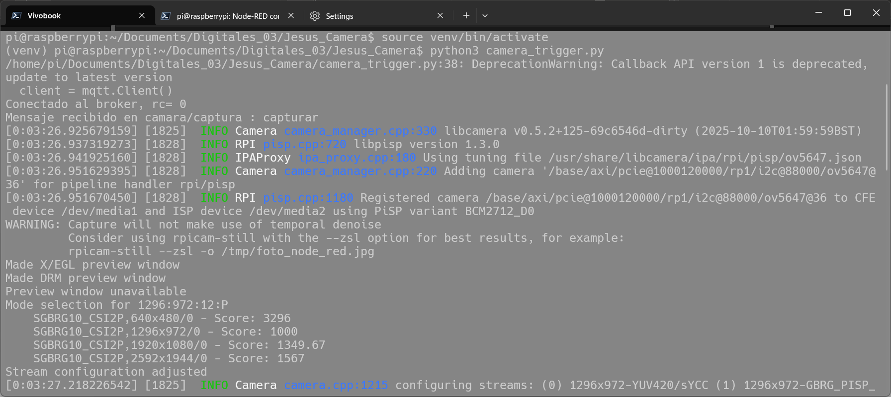
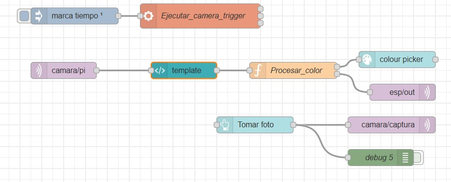
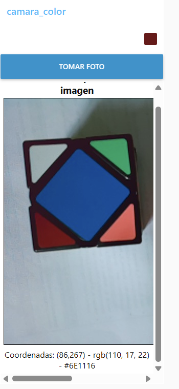

# DOCUMENTACIÓN FINAL PROYECTO INTEGRADOR


# Integrantes

[1. Jesus Zuluaga](https://github.com/zuluagajesus973-hub)

[2. Kevin Vivas](https://github.com/Kevin-Vivas)

[3. Sebastian Bonza]() 


# Version Sitema operativo Raspberry pi
A continuación, se presenta la versión del sistema operativo que se está utilizando en la Raspberry Pi.
```bash 
pi@raspberrypi:~$ lsb_release -a
No LSB modules are available.
Distributor ID: Debian
Description:    Debian GNU/Linux 13 (trixie)
Release:        13
Codename:       trixie
```

# Camara 5MPX V1.3


La cámara Raspberry Pi Rev 1.3 5MP, (viene incluido con el sensor OV5647), es una pequeña cámara con resolución de 5 MP y video HD de hasta 1080p a 30 fps. Es compatible con las Raspberry Pi 1, 2, 3, 4 y 5 para tomar fotos y videos, ya que todas usan la interfaz MIPI CSI (Camera Serial Interface).

La cámara es compatible con la última versión de Raspberry Pi OS (lo que antes era Raspbian). Ahora, es importante tomar en cuenta que para algunos modelos, como la Raspberry Pi 5 y las versiones Zero, se requiere un cable FPC diferente.

Esto es debido a que estas placas (Pi 5 y Zero) usan un conector de 22 pines de paso más fino en la placa, mientras que este módulo de cámara (el Rev 1.3) trae el conector estándar de 15 pines. Por esto, es necesario hacer uso de un cable adaptador, como el de referencia SC1128, que hace la conversión de 22 pines (lado Pi) a 15 pines (lado cámara), como se muestra a continuación.


## Nota 📝

Raspberry Pi OS Bookworm renombró las aplicaciones de captura de cámara de libcamera-*`<nombre_de_la_cámara>` a ` rpicam-*<nombre_de_la_cámara>`. Por ahora, los enlaces simbólicos permiten usar los nombres antiguos. Adopta los nuevos nombres de las aplicaciones lo antes posible. Las versiones de Raspberry Pi OS anteriores a Bookworm aún usan el libcamera-*nombre `<nombre_de_la_cámara>`.

- ```rpicam-hello:``` Un equivalente a "hola mundo" para cámaras, que inicia una transmisión de vista previa de la cámara y la muestra en la pantalla.

- ```rpicam-jpeg:``` Abre una ventana de vista previa y luego captura imágenes fijas de alta resolución.

- ```rpicam-still``` Emula muchas de las características de la raspistill aplicación original.

- ```rpicam-vid``` Captura vídeo.

Para mayor información Consultar  [Camera_Software_Raspberrypi](https://www.raspberrypi.com/documentation/computers/camera_software.html)


## Especificaciones de la camara 
- Resolución de 5 megapixeles nativa.
- Soporta imágenes de 2592×1944.
- Video a 1080p a 30fps.
- Video a 720p a 60fps.
- Video a 640×480 a 60/90fps.
- Interface por cable plano de 150mm.
- Tamaño 25 mm X 20 mm X 9 mm.


## Objetivo
Este proyecto consiste en la integración de una interfaz de adquisición y procesamiento de imágenes. El sistema se centra en la captura de imágenes mediante un módulo de cámara acoplado a una Raspberry Pi, utilizando el entorno de desarrollo Node-RED como plataforma central para la visualización y el control del flujo de datos.


La implementación consiste en una secuencia de nodos específicamente configurados para:


-   Gestionar la captura de una imagen desde la interfaz de Node-RED.
-   Visualizar la imagen proveniente de la cámara en un Dashboard interactivo.
-   Permitir la selección interactiva de un píxel específico por parte del usuario directamente sobre la imagen capturada.
-   Procesar el color seleccionado a través de una función personalizada que extrae sus componentes en los modelos de color RGB y hexadecimal.
-   Enviar los datos de color resultantes a través del protocolo de comunicación MQTT, con el fin de ser recibidos por un dispositivo externo como un ESP32.


## Configuración inicial Captura imagen  de la Raspberry Pi

Para realizar la captura de la foto y guardarla en el directorio deseado, es necesario utilizar el siguiente comando que se muestra a continuación, el cual permite ejecutar la toma de imagen desde la cámara conectada a la Raspberry Pi y almacenarla con el formato y nombre definidos por el administrador:
```bash
rpicam-still --encoding png --output ~/Pictures/Camera_PI/test.png --immediate --viewfinder-width 640 --viewfinder-height 480
```

- ```rpicam-still``` Puede guardar imágenes en múltiples formatos, incluyendo png, bmp, y volcados binarios de píxeles RGB y YUV. Para leer estos volcados binarios, cualquier aplicación que acceda a los archivos debe comprender la disposición de los píxeles.

- ```encoding``` Opción para especificar un formato de salida. El nombre del archivo que se le pase output no influye en el tipo de archivo de salida.

- ```-output``` Para capturar una imagen, guardarla en un archivo con el nombre test.pn.

- ```immediate``` Dado que las exposiciones largas ya consumen bastante tiempo, suele ser conveniente omitir por completo la fase de previsualización con esta opción.

- ```--viewfinder```  Cada uno acepta un único número que define las dimensiones, en píxeles, de la imagen mostrada en la ventana de vista previa. No afecta a las dimensiones de la ventana de vista previa, ya que las imágenes se redimensionan para ajustarse. No afecta a las imágenes fijas ni a los vídeos capturados.

### Flujo I: Adquisición de Imagen

Este proceso es responsable de la captura y publicación de la imagen.

1.  **Inicio de Captura (Botón del Dashboard "Tomar foto"):** El proceso es iniciado por el usuario a través del botón **"Tomar foto"**, un componente de la interfaz de usuario del **Dashboard de Node-RED**. Técnicamente, este botón corresponde a un nodo de tipo `inject` en el flujo de trabajo, el cual está configurado para mostrarse en el Dashboard y enviar un mensaje (payload) al ser presionado. Su función es actuar como el disparador manual de todo el ciclo de captura.
2.  **Publicación del Disparador:** El mensaje generado por el botón es dirigido a un nodo de salida MQTT (`camara/captura`), que lo publica de inmediato en el tópico correspondiente. Este mensaje sirve como una señal de comando para el script que controla la cámara.
3.  **Ejecución de Script:** Un script en Python (`camera_trigger.py`), operando como un servicio en segundo plano en la Raspberry Pi, está suscrito a dicho tópico. Al recibir el mensaje de activación, el script procede a ejecutar la captura.
4.  **Procesamiento y Publicación de la Imagen:** El script invoca la utilidad `libcamera-jpeg` para obtener una imagen. A continuación, esta imagen es codificada en formato Base64 y publicada en el tópico MQTT `camara/pi`.


### Flujo II: Procesamiento de Color

Este flujo se activa tras la recepción de una nueva imagen y gestiona la interacción del usuario.

1.  **Recepción de Imagen:** Un nodo de entrada MQTT (`camara/pi`) recibe la imagen codificada y la transmite al siguiente nodo del flujo.
2.  **Renderizado en Interfaz:** La imagen es renderizada en un elemento `<canvas>` HTML5 dentro de un nodo `template`, permitiendo su visualización en el Dashboard de Node-RED.
3.  **Selección Interactiva:** El código JavaScript embebido en el nodo `template` detecta el evento de clic del usuario sobre el canvas y extrae los datos de color del píxel seleccionado.
4.  **Retorno de Datos:** Esta información es encapsulada en un objeto `payload` y enviada de vuelta al flujo principal de Node-RED.
5.  **Distribución de la Información:** Un nodo `function` (`Procesar_color`) recibe el objeto, lo procesa y bifurca la información hacia dos salidas para su visualización y envío al dispositivo final.


---

# Implementación y Puesta en Marcha

Para el correcto funcionamiento del sistema, es necesario seguir los siguientes pasos en la Raspberry Pi.

1.  **Ubicación de Archivos:** Se ha creado un directorio específico para alojar los archivos del proyecto en la ruta: `/Documents/Digitales_03/Camera`.

2.  **Instalación de Dependencias:** Para que el script de Python (`camera_trigger.py`) pueda comunicarse a través del protocolo MQTT, requiere una librería externa específica. Esta librería es `paho-mqtt`. Antes de ejecutar el script, es indispensable instalar esta dependencia abriendo una terminal en la Raspberry Pi y ejecutando el siguiente comando:

    ```bash
    pip3 install paho-mqtt
    ```

3.  **Ejecución del Script:** Una vez instalada la dependencia, el script `camera_trigger.py` debe ser ejecutado en segundo plano. Para ello, navegue hasta el directorio del proyecto y ejecute:

    ```bash
    python3 camera_trigger.py
    ```
    Este comando iniciará el cliente MQTT, que quedará a la escucha de las instrucciones enviadas desde el Dashboard de Node-RED.





---

# Diagrama Flujo Node_Red 

A continuacion se muestra el digrama de flujo implementado en node red como se visualiza en la siguiente imagen 



### Explicación de los Componentes de Código

A continuación, se detalla la lógica de programación detrás de los nodos y scripts más importantes del sistema.

#### [1. Script de Control de Cámara (`camera_trigger.py`)](3.Micropython/camera_trigger.py)

Este es un script de Python que se ejecuta continuamente en la Raspberry Pi y actúa como el puente entre Node-RED y la cámara física.

*   **Función Principal:** Su única tarea es escuchar mensajes en un tópico MQTT específico (`camara/captura`). Cuando recibe un mensaje válido (como la palabra "capturar"), activa la cámara.
*   **Proceso de Captura:**
    1.  **Tomar la Foto:** Utiliza la biblioteca `subprocess` para ejecutar un comando de terminal: `libcamera-jpeg`. Este comando instruye al sistema operativo de la Raspberry Pi para que use la cámara, tome una foto de 640x480 píxeles y la guarde temporalmente en un archivo llamado `/tmp/foto_node_red.jpg`.
    2.  **Codificar y Publicar:** Inmediatamente después, ejecuta un segundo comando de terminal más complejo. Este comando toma el archivo de imagen recién creado, lo convierte a formato de texto Base64, le añade el prefijo `data:image/jpeg;base64,` (necesario para que los navegadores web entiendan que es una imagen), y publica toda esa cadena de texto en un tópico MQTT  (`camara/pi`).
*   **Mecanismo de Escucha:** El script utiliza la biblioteca `paho-mqtt` para conectarse al broker MQTT. Permanece en un bucle infinito (`loop_forever`), esperando pasivamente la señal de disparo desde Node-RED para iniciar el proceso de captura.

---

#### [2. Nodo `template`](1.Flujos_Node_Red/2.Node_Template.java)

Este nodo contiene una combinación de código HTML y JavaScript que crea el elemento visual en el Dashboard de Node-RED.

* **Visualización:** El código se encarga de recibir la cadena **Base64** del tópico `camara/pi` y dibujarla sobre el elemento HTML `<canvas>`.

* **Detección de Clic:** El script está escuchando constantemente los clics del usuario sobre la imagen. Al hacer clic, obtiene las coordenadas exactas **(x, y)**.

* **Extracción de Color:** Utiliza `ctx.getImageData` para obtener los valores del píxel seleccionado en el modelo **RGB (Rojo, Verde, Azul)**.

* **Conversión a CMYKW (Modelo Completo):** La función `rgbToCMYKW` dentro del script es clave. Transforma el color **RGB (Aditivo)** a los componentes **CMYKW (Sustractivo)** y, lo más importante, realiza un ajuste de redondeo para asegurar que la suma de todos los porcentajes sea siempre **100%**.

* **Salida de Datos:** Empaqueta todos los datos (x, y, RGB, HEX, y CMYKW) en un mensaje de salida para el siguiente nodo del flujo.

---

#### [3. Nodo `function` (Procesar_color)](1.Flujos_Node_Red/1.Funtion_Procesar_Color.java)


Este nodo es el distribuidor de información. Recibe los datos del color y los prepara para el Dashboard y para el actuador externo.

* **Lógica de Procesamiento de Color:** Este nodo contiene una implementación **alternativa de CMYK/W** que utiliza el algoritmo estándar para extraer el Negro (K) y el Blanco (W) simple.

    * **Extracción de Negro (K):** $K = 1 - \max(R, G, B)$
    * **Cálculo de CMY:** $C = \frac{(1 - R - K)}{(1 - K)}$
    * **Blanco (W) Simple:** $W = \min(R, G, B)$

* **Salida Múltiple (Doble Bifurcación):** El nodo tiene dos salidas:

    1. **Salida 1 (Payload HEX):** Envía solo el color **hexadecimal** (ej. `"#FF5733"`) para alimentar el nodo **`ui_colour_picker`** del Dashboard.

    2. **Salida 2 (Payload Completo):** Envía la cadena de texto completa con todas las coordenadas y valores de color. Este mensaje alimenta el **`mqtt out`** en el tópico **`esp/out`**, destinado a un microcontrolador (ESP32) para control de actuadores.

---

### 1. Nodo `exec` ([Ejecutar_camera_trigger](3.Micropython/camera_trigger.py)) 

Este nodo es el **disparador principal** del script que controla la cámara. Es fundamental para asegurar que el sistema de escucha esté operativo.

* **Función Vital:** Su tarea es arrancar el script de Python que queda en modo escucha. Solo se ejecuta **una vez** al desplegar el flujo:

    ```bash
    python3 /home/hediy/proyecto_camara/scripts/camera_trigger.py
    ```

* **Modo de Ejecución:** El nodo `exec` se configura para ejecutar el comando en segundo plano y dejarlo corriendo. Al estar conectado al nodo `inject` con la opción de "solo al inicio", garantizamos que el script de Python que escucha por MQTT esté siempre activo.

---


# Visualización del Panel en Node-RED



---
# Aspectos importantes a tomar en consideración
Para la captura con la cámara, es imprescindible contar con una buena iluminación , ya que esto garantiza una detección correcta de los colores.  


## Conclusiones
En esta etapa se logró integrar de forma funcional la cámara Raspberry Pi con la plataforma Node-RED, verificando la comunicación entre el hardware y el entorno de automatización. Se implementó la captura de imágenes desde la cámara usando rpicam-still y se configuró Node-RED como servidor estático para mostrar y refrescar las imágenes en el dashboard.

Además, se desarrolló un flujo interactivo que permite seleccionar un píxel sobre la imagen, extraer su color (RGB), convertirlo a CMYK y registrar los resultados en un archivo de log. Se dejaron preparadas las salidas necesarias para el envío vía MQTT hacia una ESP32, así como los nodos que formatean y presentan la información en el dashboard.

# Referencia 
[[1]  Camera_Software_Raspberrypi](https://www.raspberrypi.com/documentation/computers/camera_software.html)