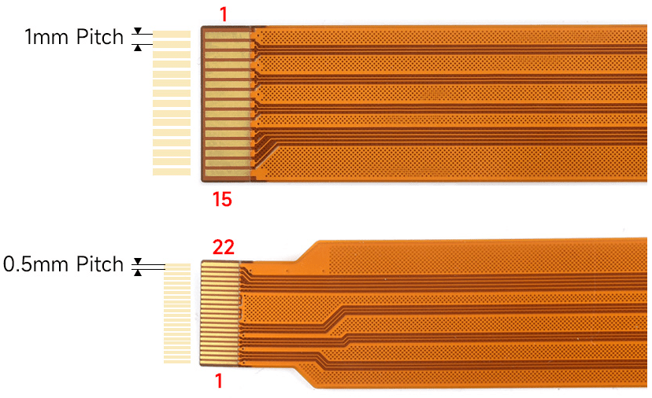
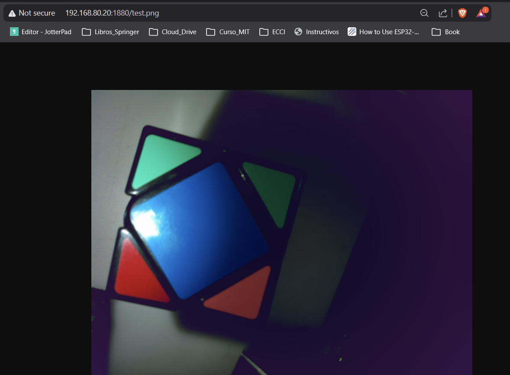
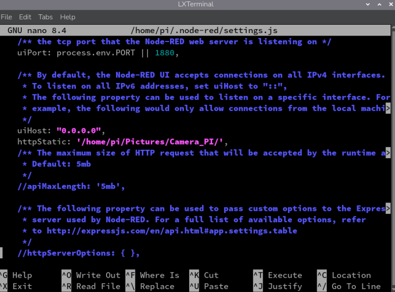
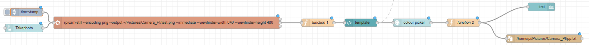
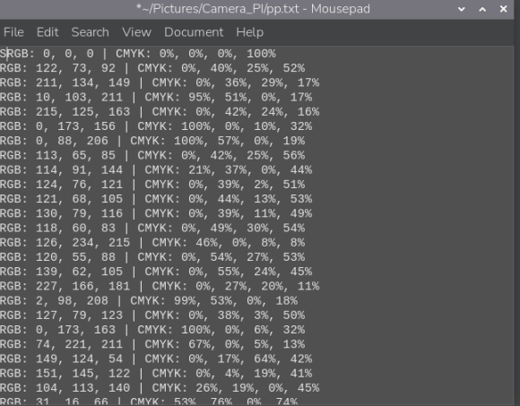

# DOCUMENTACIÓN DEL AVANCE DEL PROYECTO INTEGRADOR
Fecha Entrega  11/3/2025


# Integrantes

[1. Jesus Zuluaga](https://github.com/zuluagajesus973-hub)

[2. Kevin Vivas](https://github.com/Kevin-Vivas)

[3. Sebastian Bonza]() 


# Version Sitema operativo Raspberry pi
A continuación, se presenta la versión del sistema operativo que se está utilizando en la Raspberry Pi.
```bash 
pi@raspberrypi:~$ lsb_release -a
No LSB modules are available.
Distributor ID: Debian
Description:    Debian GNU/Linux 13 (trixie)
Release:        13
Codename:       trixie
```

# Camara 5MPX V1.3


La cámara Raspberry Pi Rev 1.3 5MP, (viene incluido con el sensor OV5647), es una pequeña cámara con resolución de 5 MP y video HD de hasta 1080p a 30 fps. Es compatible con las Raspberry Pi 1, 2, 3, 4 y 5 para tomar fotos y videos, ya que todas usan la interfaz MIPI CSI (Camera Serial Interface).

La cámara es compatible con la última versión de Raspberry Pi OS (lo que antes era Raspbian). Ahora, es importante tomar en cuenta que para algunos modelos, como la Raspberry Pi 5 y las versiones Zero, se requiere un cable FPC diferente.

Esto es debido a que estas placas (Pi 5 y Zero) usan un conector de 22 pines de paso más fino en la placa, mientras que este módulo de cámara (el Rev 1.3) trae el conector estándar de 15 pines. Por esto, es necesario hacer uso de un cable adaptador, como el de referencia SC1128, que hace la conversión de 22 pines (lado Pi) a 15 pines (lado cámara), como se muestra a continuación.





## Nota 📝

Raspberry Pi OS Bookworm renombró las aplicaciones de captura de cámara de libcamera-*`<nombre_de_la_cámara>` a ` rpicam-*<nombre_de_la_cámara>`. Por ahora, los enlaces simbólicos permiten usar los nombres antiguos. Adopta los nuevos nombres de las aplicaciones lo antes posible. Las versiones de Raspberry Pi OS anteriores a Bookworm aún usan el libcamera-*nombre `<nombre_de_la_cámara>`.

- ```rpicam-hello:``` Un equivalente a "hola mundo" para cámaras, que inicia una transmisión de vista previa de la cámara y la muestra en la pantalla.

- ```rpicam-jpeg:``` Abre una ventana de vista previa y luego captura imágenes fijas de alta resolución.

- ```rpicam-still``` Emula muchas de las características de la raspistill aplicación original.

- ```rpicam-vid``` Captura vídeo.

Para mayor informacion Consultar  [Camera_Software_Raspberrypi](https://www.raspberrypi.com/documentation/computers/camera_software.html)


## Especificaciones de la camara 
- Resolución de 5 megapixeles nativa.
- Soporta imágenes de 2592×1944.
- Video a 1080p a 30fps.
- Video a 720p a 60fps.
- Video a 640×480 a 60/90fps.
- Interface por cable plano de 150mm.
- Tamaño 25 mm X 20 mm X 9 mm.


## Objetivo
Este proyecto consiste en la integración de una interfaz de adquisición y procesamiento de imágenes. El sistema se centra en la captura de imágenes mediante un módulo de cámara acoplado a una Raspberry Pi, utilizando el entorno de desarrollo Node-RED como plataforma central para la visualización y el control del flujo de datos.


La implementación consiste en una secuencia de nodos específicamente configurados para:


- Capturar y visualizar la imagen proveniente de la cámara en la interfaz de Node-RED.
- Permitir la selección interactiva de un color específico por parte del usuario directamente sobre la imagen capturada.
- Procesar el color seleccionado a través de una función personalizada que extrae sus componentes y los convierte a los modelos de color RGB y CMYK.
- Envio los datos de color resultantes (RGB y CMYK) a través del protocolo de comunicación MQTT a una ESP32.
- Guarda los datos de color resultantes (RGB y CMYK) a través de un archivo .txt.


## Configuración inicial Captura imagen  de la Raspberry Pi

Para realizar la captura de la foto y guardarla en el directorio deseado, es necesario utilizar el siguiente comando que se muestra a continuación, el cual permite ejecutar la toma de imagen desde la cámara conectada a la Raspberry Pi y almacenarla con el formato y nombre definidos por el administrador:
```bash
rpicam-still --encoding png --output ~/Pictures/Camera_PI/test.png --immediate --viewfinder-width 640 --viewfinder-height 480
```

- ```rpicam-still``` Puede guardar imágenes en múltiples formatos, incluyendo png, bmp, y volcados binarios de píxeles RGB y YUV. Para leer estos volcados binarios, cualquier aplicación que acceda a los archivos debe comprender la disposición de los píxeles.

- ```encoding``` Opción para especificar un formato de salida. El nombre del archivo que se le pase output no influye en el tipo de archivo de salida.

- ```-output``` Para capturar una imagen, guardarla en un archivo con el nombre test.pn.

- ```immediate``` Dado que las exposiciones largas ya consumen bastante tiempo, suele ser conveniente omitir por completo la fase de previsualización con esta opción.

- ```--viewfinder```  Cada uno acepta un único número que define las dimensiones, en píxeles, de la imagen mostrada en la ventana de vista previa. No afecta a las dimensiones de la ventana de vista previa, ya que las imágenes se redimensionan para ajustarse. No afecta a las imágenes fijas ni a los vídeos capturados.

# Habilitación del Servidor de Contenido Estático

Para la correcta visualización de las imágenes capturadas por el sistema a través de un navegador web, es imperativo configurar Node-RED para que actúe como un servidor de archivos estáticos.

El primer paso consiste en acceder al archivo de configuración principal de Node-RED, ```settings.js.``` Para ello, se ejecutará el siguiente comando en la terminal, utilizando el editor nano con privilegios de superusuario para garantizar los permisos de escritura:


```Bash
sudo nano ~/.node-red/settings.js
```

Dentro del archivo de configuración, es necesario localizar la directiva ```httpStatic.``` Esta propiedad, que por defecto se encuentra comentada, define el directorio que Node-RED servirá públicamente. Se debe descomentar (eliminando los caracteres // al inicio de la línea) y asignarle la ruta absoluta al directorio que contiene las imágenes de la cámara.
El parámetro a configurar es el siguiente, el cual mapea el contenido del directorio a la ```URL``` raíz del servidor de Node-RED:

```JavaScript

    httpStatic: '/home/pi/Pictures/Camera_PI/',
```
Al establecer esta configuración, cualquier archivo dentro de /home/pi/Pictures/Camera_PI/ (por ejemplo, test.png) se vuelve accesible a través de la URL ```http://[IP_DE_LA_RASPBERRY_PI]:1880/test.png```

Como se puede visualizar en la siguiente imagen:



A continuación, se muestra una imagen de la sección correspondiente del archivo settings.js debidamente modificada:




Una vez que la directiva ```httpStatic``` ha sido modificada, es fundamental guardar los cambios en el archivo settings.js de manera correcta. El editor nano proporciona un flujo de salida específico para este propósito.
Al presionar la combinación de teclas ```Ctrl + X,``` se inicia el proceso para salir del editor. nano detectará que el buffer del archivo ha sido modificado y solicitará una confirmación para guardar los cambios, como se ilustra en la siguiente línea de la terminal:

En este punto, se debe presionar la tecla Y (correspondiente a "Yes") para confirmar la intención de guardar. Posteriormente, el editor solicitará que se confirme el nombre del archivo a escribir. Dado que estamos editando un archivo existente, simplemente se debe presionar la tecla ```Enter``` para sobrescribir el archivo ```settings.js``` con la nueva configuración.

El procedimiento completo es el siguiente:


1. Iniciar salida: ```Ctrl + X```
2. Confirmar guardado: ```Y```
3. Confirmar nombre de archivo: ```Enter```


# Diagrama Flujo Node_Red 

A continuacion se muestra el digrama de flujo implementado en node red como se visualiza en la siguiente imagen 



# 4.1 Desglose de Componentes del Flujo
El flujo se segmenta en tres fases operativas principales: iniciación, ejecución y post-procesamiento.


**Fase 1: Iniciación de Captura**

El proceso se inicia mediante dos nodos de tipo inject: 


- ```timestamp:``` Este nodo, al ser activado, inyecta una marca de tiempo (timestamp) en el flujo. Su función principal es servir como un disparador automático o programado.

- ```Takephoto:``` Este nodo actúa como un disparador manual. Al ser presionado desde la interfaz de Node-RED por el usuario, envía una señal para iniciar el proceso de captura de manera inmediata.

**Fase 2: Ejecución del Comando de Captura**

Ambos nodos de inyección están conectados a un nodo exec. Este componente es fundamental, ya que es el encargado de ejecutar comandos directamente en la terminal del sistema operativo de la Raspberry Pi.
El comando configurado en este nodo es el siguiente:

```bash
rpicam-still --encoding png --output ~/Pictures/Camera_PI/test.png --immediate --viewfinder-width 640 --viewfinder-height 480
```

**Fase 3: Post-procesamiento y Salida de Datos**

##   [Nodo function 1:](1.Flujos_Node_Red/1.Funtion_01.java)

Este nodo prepara el mensaje para el refresco de la imagen en el dashboard. 


La función principal de este código es realizar un "cache busting". Al añadir un parámetro de consulta (?t=) con el timestamp actual, se asegura que el navegador web del cliente solicite siempre la versión más reciente del archivo /test.png, evitando que se muestre una imagen previamente almacenada en la caché.

## [Nodo template: ](1.Flujos_Node_Red/3.Node_Template.java)

Este es el componente más complejo de la interfaz. Crea un widget interactivo en el Dashboard que permite al usuario ver la imagen y seleccionar un píxel.

- Estructura (HTML/CSS): Define un elemento ```<canvas>``` para renderizar la imagen y un ```<div>``` para mostrar la información del color seleccionado (una muestra de color y los valores RGB/coordenadas). El CSS asegura que el cursor se transforme en una cruz (crosshair) para mejorar la precisión de la selección.

**Lógica (JavaScript):**

1. **Carga de Imagen:** El script carga la imagen test.png en el canvas. Utiliza la misma técnica de "cache busting" que el nodo function 1 para garantizar que la imagen esté actualizada.

2. **Manejo de Eventos:** El script añade un event listener para el evento click sobre el canvas.

3. **Extracción de Color:** Al hacer clic, se calculan las coordenadas exactas del píxel seleccionado y se utiliza el método ctx.getImageData(x, y, 1, 1).data para extraer el valor RGBA del píxel.

4. **Actualización de la UI:** La interfaz del widget se actualiza en tiempo real, mostrando el color en la muestra (swatch) y los valores numéricos.
Envío de Datos: Este es el paso crucial. El script empaqueta los valores R, G y B en un objeto JSON y lo asigna como payload de un nuevo mensaje. Este mensaje se envía a la salida del nodo template usando scope.send(newMsg), permitiendo que el flujo continúe con los datos de color seleccionados.

# Nodo colour picker: 


Este nodo de dashboard actúa como intermediario. Recibe el objeto JSON {r, g, b} enviado por el nodo template y lo convierte a un formato de color estándar, en este caso, una cadena de texto hexadecimal (ej. "#RRGGBB"). Este formato estandarizado es el que se pasa al siguiente nodo de procesamiento.

Configuración  colour picker :


# [Nodo function 2:](1.Flujos_Node_Red/2.Nodo_Funtion_2.java)

Este nodo recibe el color en formato hexadecimal y realiza la conversión final y el formateo de los datos.

- **Paso 1 y 2:** Valida la entrada y convierte la cadena hexadecimal a sus componentes R, G, B numéricos (0-255).

- **Paso 3:** Implementa el algoritmo de conversión de RGB a CMYK. Normaliza los valores RGB a un rango de 0-1, calcula el componente K (negro) y, a partir de este, los componentes C, M e Y. Los resultados se escalan a un porcentaje (0-100).

- **Paso 4:** Formatea múltiples salidas en el objeto msg. msg.payload se prepara para visualización directa en el dashboard. Se crean objetos msg.rgb y msg.cmyk para un posible uso futuro. Finalmente, se genera msg.filePayload, una cadena en formato CSV-like con timestamp y todos los valores de color, lista para ser almacenada.

# Nodo text: 

Un nodo simple del dashboard que muestra el contenido de msg.payload (la cadena RGB | CMYK) al usuario.


# Nodo file (/home/pi/Pictures/Camera_PI/pp.txt): 

Este nodo file out está configurado para añadir (append) el contenido de la propiedad msg.filePayload al final del archivo pp.txt. De esta manera, cada selección de color queda registrada de forma persistente junto con su timestamp y sus valores RGB/CMYK, creando un log de datos completo.

Evidencia Fotográfica :



# Aspectos importantes a tomar en consideración

- 📸 Para la captura con la cámara, es imprescindible contar con una buena iluminación 💡, ya que esto garantiza una detección correcta de los colores.  

- 🔧 Actualmente se está trabajando en el envío mediante **MQTT** hacia la **Raspberry Pi**.  Cualquier recomendación o apreciación sobre la implementación es muy bien recibida por parte de la docente **Diana**. 🙌  


## Conclusiones
En esta etapa se logró integrar de forma funcional la cámara Raspberry Pi con la plataforma Node-RED, verificando la comunicación entre el hardware y el entorno de automatización. Se implementó la captura de imágenes desde la cámara usando rpicam-still y se configuró Node-RED como servidor estático para mostrar y refrescar las imágenes en el dashboard.

Además, se desarrolló un flujo interactivo que permite seleccionar un píxel sobre la imagen, extraer su color (RGB), convertirlo a CMYK y registrar los resultados en un archivo de log. Se dejaron preparadas las salidas necesarias para el envío vía MQTT hacia una ESP32, así como los nodos que formatean y presentan la información en el dashboard.

Aspectos alcanzados:

- Captura y visualización de imágenes desde la Raspberry Pi.
- Widget interactivo para selección de color y extracción de valores RGB.
- Conversión a CMYK y almacenamiento en archivo (log).
- Preparación del flujo para envío de datos por MQTT.

# Referencia 
[[1]  Camera_Software_Raspberrypi](https://www.raspberrypi.com/documentation/computers/camera_software.html)