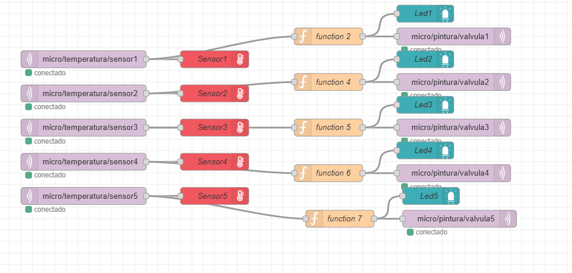
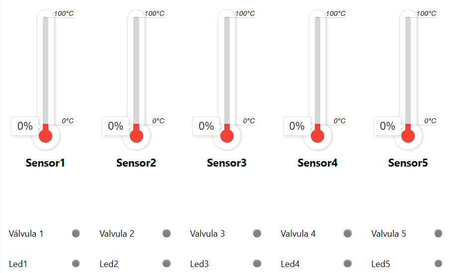
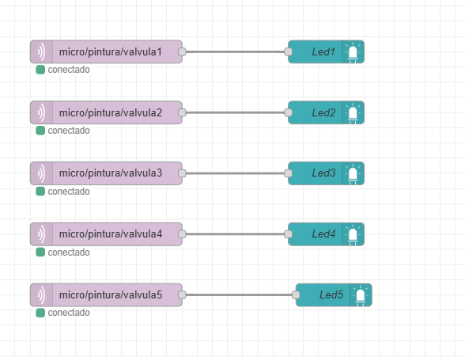

# Nombre de la etapa:

## Integrantes
Maria Paula Fierro Barrios (https://github.com/fierrobarriosmariapaula-blip)

Astrid Catalina Ortiz Lopez (https://github.com/astridcortizl-del)

Camilo Suarez Camacho (https://github.com/Camilosc13)

## Documentación

## Objetivo General

Diseñar e implementar un sistema distribuido de monitoreo y control de temperatura basado en ESP32, con comunicación MQTT y visualización en Node-RED que permita activar válvulas y resistencias automáticamente al superar un umbral térmico definido.

### Funcionamiento del Sistema

**Capa 1: Lectura de Sensores (ESP32)**

El ESP32 recibe señales de cinco sensores DS18B20 conectados en diferentes pines (33, 25, 26, 27, 14).
Cada sensor mide la temperatura y publica los valores por MQTT en los siguientes tópic:

- micro/temperatura/sensor1
- micro/temperatura/sensor2
- micro/temperatura/sensor3
- micro/temperatura/sensor4
- micro/temperatura/sensor5

**Capa 2: Control Local**

El ESP32 compara cada lectura con un umbral de 30°C (TEMP_UMBRAL).

- Si la temperatura ≥ 30°C → activa la válvula correspondiente enviando ON al tópico MQTT.
- Si la temperatura < 30°C → envía OFF para desactivar la válvula.

Tópic de control:

- micro/pintura/valvula1
- micro/pintura/valvula2
- micro/pintura/valvula3
- micro/pintura/valvula4
- micro/pintura/valvula5

  
   
  <b>Figura 1.</b> Flujo de monitoreo de temperatura en Node-RED.

**Capa 3: Visualización en Node-RED**

En Node-RED se visualizan las temperaturas y estados:

- Indicadores tipo termómetro muestran la temperatura en tiempo real.
- LEDs representan el estado de cada válvula (encendida o apagada).

El flujo incluye:

- Nodos MQTT IN para recibir datos de temperatura.
- Nodos Function que procesan las condiciones de temperatura.
- Nodos MQTT OUT para enviar comandos de activación/desactivación.
- Dashboard con widgets de temperatura y estado de válvulas.

  
   
  <b>Figura 2.</b> Panel de control (Dashboard) en Node-RED para visualizar las temperaturas y estados de válvulas.

## Variables y Parámetros Principales

| **Variable**          | **Descripción**                                   | **Tipo**          |
|------------------------|--------------------------------------------------|-------------------|
| **TEMP_UMBRAL**        | Umbral de activación de válvulas (30°C)          | Float             |
| **datos**              | Diccionario con las lecturas actuales            | Dict              |
| **estado_valvulas**    | Lista con el estado ON/OFF de cada válvula       | Boolean list      |
| **json_filename**      | Archivo donde se guardan los registros           | String            |
| **MQTT_TOPICS_TEMP**   | Lista de tópicos de publicación de temperatura   | List              |
| **MQTT_TOPICS_VALVULAS** | Lista de tópicos de control de válvulas        | List              |

**Registro de Datos**

Cada ciclo de lectura guarda las temperaturas en un archivo local temperaturasSensores.json, que actúa como un histórico de las mediciones.

El formato JSON permite analizar tendencias o generar reportes posteriores.

## Pruebas ESP32 y Node Red

 ## [Funciones Especiales del Código SensoresValvulas.py](/G09/micropython/SensoresValvulas.py)

- **KeyboardInterrupt:**
Permite detener manualmente el programa (con Ctrl + C) sin perder control.
Cuando se interrumpe, el script automáticamente ejecuta otro archivo (MqttValvula.py), garantizando que el sistema no quede inactivo.

- **try/except:**
Evita que errores en sensores o la conexión WiFi detengan el sistema.
En caso de falla, reinicia o ejecuta un script alterno.

- **os.system("MqttValvula.py"):**
Sirve para lanzar otro proceso cuando ocurre una interrupción o error, útil como mecanismo de respaldo o failover.

 ## [Funcionamiento y funciones Especiales del Código MqttValvula.py](/G09/micropython/MqttValvula.py)

Este código **“ MQTT VALVULAS”** hace que la ESP32 funcione como un dispositivo inteligente que controla 5 válvulas por medio de mensajes enviados por internet, usando el protocolo MQTT.

Explicación código 
1.	Conexión WiFi
El ESP32 se conecta primero a tu red WiFi usando la información que está en el archivo wifi.py.
Si no se conecta, se queda esperando, porque sin internet no puede hablar con el servidor MQTT.
2.	Configuración MQTT
Luego, se define el broker MQTT (que es el servidor que reparte los mensajes) y se indican los nombres de los topics donde el ESP32 va a escuchar las órdenes para las válvulas.
En este caso son:
micro/pintura/valvula1
micro/pintura/valvula2 , etc… 
3.	Definición de pines
El ESP32 tiene pines digitales que pueden activar o desactivar cosas.
Aquí se asocia cada válvula a un pin físico (por ejemplo, el pin 15 controla la válvula 1, el 16 la válvula 2, etc.).
Así, cuando llegue un mensaje para “valvula3”, el programa sabrá que debe encender o apagar el pin 17.
4.	Recepción de mensajes
El código tiene una función llamada on_message() que se ejecuta automáticamente cada vez que llega un mensaje nuevo desde el servidor MQTT.
Si el mensaje dice "ON", el pin correspondiente se activa (enciende la válvula).
Si dice "OFF", se apaga.
5.	Suscripción a los topics
El ESP32 se “suscribe” a los cinco topics.
Esto significa que el servidor MQTT le avisará cada vez que llegue un mensaje nuevo a esos canales.
6.	Bucle principal
El programa entra en un ciclo infinito donde constantemente revisa si hay mensajes nuevos.
Si los hay, llama a la función on_message() y ejecuta la acción correspondiente.

Términos nuevos o importantes
 

    "Callback": "Una función que se ejecuta automáticamente cuando ocurre un evento (por ejemplo, cuando llega un mensaje)."

    "check_msg()": "Método que revisa si hay nuevos mensajes MQTT."

    "subscribe()": "Indica al broker que quieres recibir los mensajes de un topic."

    "decode()": "Convierte un dato en bytes a texto normal."

    "value(1) / value(0)": "Enciende (1) o apaga (0) el pin del ESP32."

 ## Funcionamiento y funciones Especiales del Código FuncionSensores

Este código “Función sensor” sirve para tomar la lectura de temperatura de un sensor y, dependiendo del valor, decidir si una válvula debe encenderse o apagarse.
Además, envía tres tipos de información hacia distintos destinos de Node-RED.
 Funciones principales
1.	Lee la temperatura
-	El código recibe la temperatura desde el sensor (en msg.payload).
-	La convierte en número para poder compararla.
2.	Compara con un valor límite (umbral)
-	Tiene un valor de referencia (por ejemplo, 30 °C).
-   Si la temperatura es mayor o igual a ese límite → el estado es "ON".
-	Si es menor → el estado es "OFF".
3.	Define los destinos (topics)
-	Un topic es como la dirección del mensaje dentro del sistema MQTT.
-	En este caso se usan dos:
- esp1/temperatura/sensor1 → donde se envía el valor de la temperatura.
-	esp2/pintura/valvula1 → donde se envía la orden para encender o apagar la válvula.
4.	Crea los mensajes
-	Uno con el valor de temperatura (para visualizarlo).
-	Otro con el estado "ON" o "OFF" (para activar la válvula).
-	Y un tercero para un LED o indicador visual en el panel (Dashboard).
5.	Envía los mensajes
-	El return [msgValve, msgSensor, msgLed] manda los tres mensajes, cada uno por una salida diferente del nodo Function.
Así, Node-RED puede enviar cada dato al destino que corresponde.

Terminos Nuevos
{
 - "payload		Es el “contenido” del mensaje que viaja entre los nodos.
 - parseFloat()	Convierte un texto en número decimal.
 - isNaN()	Revisa si un valor no es un número.
 - const / let	Formas de crear variables en JavaScript.

}

## Retos Encontrados

1.	Sincronización de sensores:
Los DS18B20 requieren un tiempo de conversión (750 ms); si no se respeta, las lecturas pueden ser erróneas.
2.	Gestión de tópicos MQTT:
Mantener nombres consistentes en Node-RED y el código es vital para evitar desconexiones o mensajes perdidos.
3.	Actualización visual en Node-RED:
Requiere configurar correctamente los widgets y funciones para reflejar el estado real en tiempo real.

