
# Proyecto integrador avance 1/11/2025

## Integrantes

[Karen Lizeth Sosa](https://github.com/karenlsosam-hub)  -  GRUPO 10

[Michael Mendez](https://github.com/michaelsmendezm-collab)  -  GRUPO 10

[Juan Acosta](https://github.com/juanfacostap-wq)  -  GRUPO 10

[Julian Rodriguez](https://github.com/juliandrodriguezp-ops)  -  GRUPO 8

[Edwin Correa](https://github.com/ECORREA-96)  -  GRUPO 8

[Ricardo Sabogal]( https://github.com/ricardosr-82)  -  GRUPO 8

## Objetivo

Implementar un sistema de lectura de peso mediante galgas extensiométricas conectadas a sus respectivos módulos HX711, los cuales entregan los valores digitales a una ESP32. De esta manera, se integra un sistema que combina la información obtenida por la cámara —encargada de sensar el color inicial— con los valores digitales de peso, con el fin de codificar dichos valores en el modelo de color CMYK y obtener así el color deseado en el recipiente final de pintura.

## Arquitectura propuesta

En el caso del Grupo 10, corresponde el desarrollo e implementación de los periféricos asociados a los sensores de peso para cada tanque de pintura, utilizando para este propósito el módulo HX711 en conjunto con una galga extensiométrica.

El sistema permite realizar la medición de peso mediante celdas de carga, empleando el HX711 como amplificador y convertidor analógico-digital (ADC), el cual entrega la señal procesada hacia el microcontrolador ESP32 para su posterior lectura y transmisión de datos.

Se adjunta el documento en formato PDF, donde se presenta el diseño del sistema, el esquema de conexiones eléctricas y la configuración de los periféricos utilizados para la correcta integración del sensor de peso con el entorno de control.

ver pfd (PLANO_CONEXIONES.pdf)

Se implementaron los programas destinados a la adquisición y visualización de los datos generados por la galga extensiométrica, empleando el entorno de desarrollo Thonny,  el lenguaje MicroPython para la programación del microcontrolador.

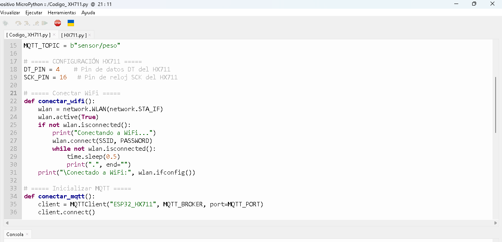

A continuación, se diseñaron los esquemas de comunicación en Node-RED y se realizó la configuración del tópico MQTT, permitiendo la visualización en tiempo real de las lecturas de la galga extensiométrica dentro del entorno de monitoreo de Node-RED.

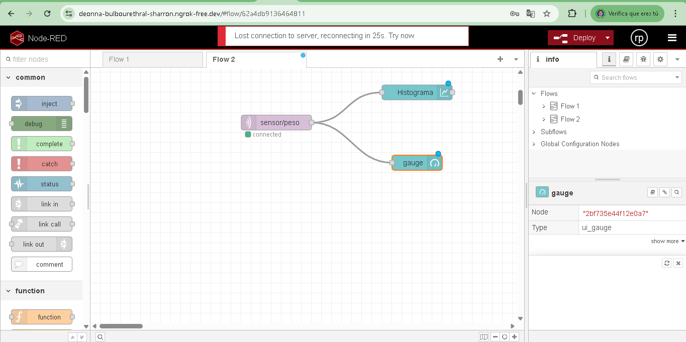

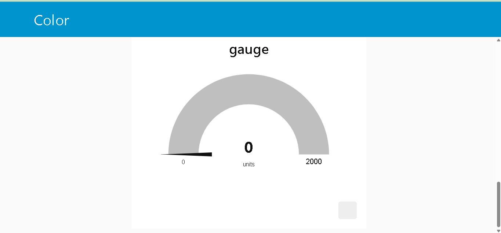

## Periférico a trabajar

#  CONFIGURACIÓN HX711 
# Pines de conexion HX711 y la esp32

VCC= FUENTE +5V
GND=GND DE LA FUENTE

# GALGA 1
DT_PIN = 12    # Pin de datos DT del HX711 pin GPIO 13 de la esp32
SCK_PIN = 13   # Pin de reloj SCK del HX711 pin GPIO 12 de la esp32

# GALGA 2
DT_PIN = 14   # Pin de datos DT del HX711 pin GPIO 16 de la esp32
SCK_PIN = 27   # Pin de reloj SCK del HX711 pin GPIO 17 de la esp32

# GALGA 3
DT_PIN = 25   # Pin de datos DT del HX711 pin GPIO 5 de la esp32
SCK_PIN = 28   # Pin de reloj SCK del HX711 pin GPIO 18 de la esp32

# GALGA 4
DT_PIN = 32   # Pin de datos DT del HX711 pin GPIO 19 de la esp32
SCK_PIN = 33   # Pin de reloj SCK del HX711 pin GPIO 3 de la esp32

# GALGA 5
DT_PIN = 4   # Pin de datos DT del HX711 pin GPIO 1 de la esp32
SCK_PIN = 16   # Pin de reloj SCK del HX711 pin GPIO 23 de la esp32

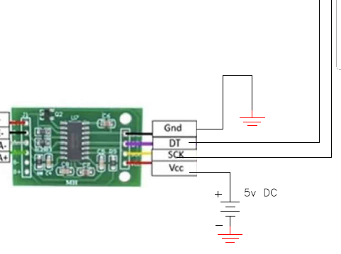

GALGA:

VCC:E+

GND:E-

SEÑAL+:A+

SEÑAL-: A-

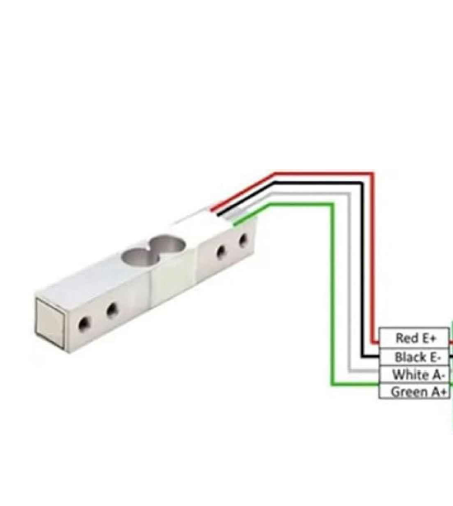

# Avances

En este apartado se presenta la evidencia fotográfica del montaje realizado por parte de nuestro equipo, correspondiente al sistema instalado.

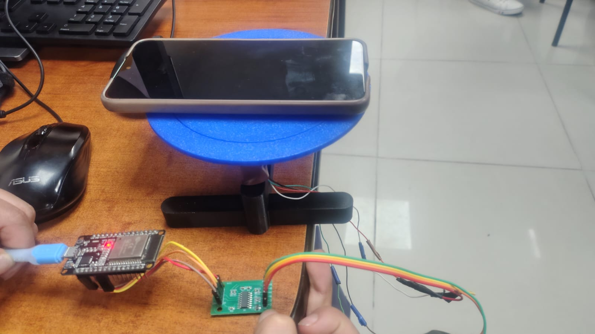

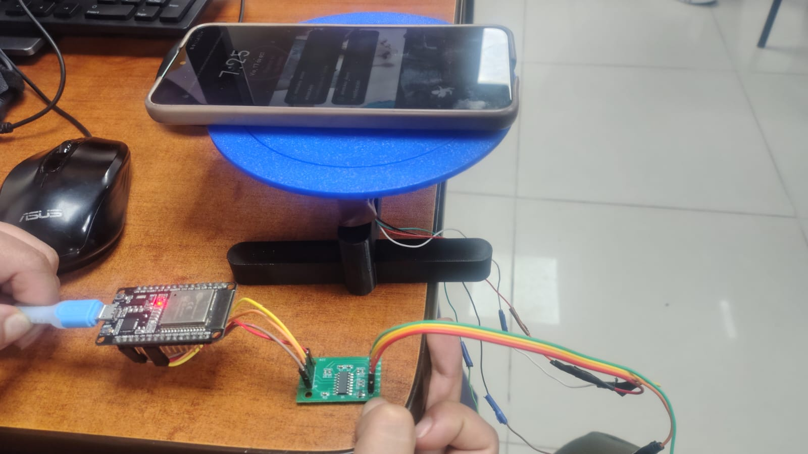

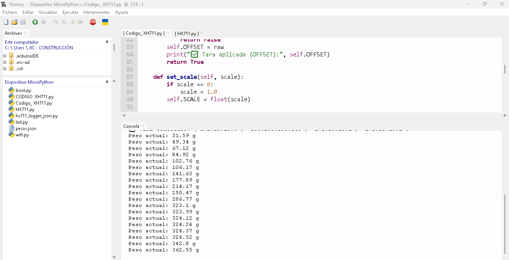

A continuación, se presenta el diseño preliminar propuesto para las bases de las galgas extensiométricas y sus respectivos recipientes, donde se alojará la pintura destinada al proceso de mezclado previo a la entrega final.

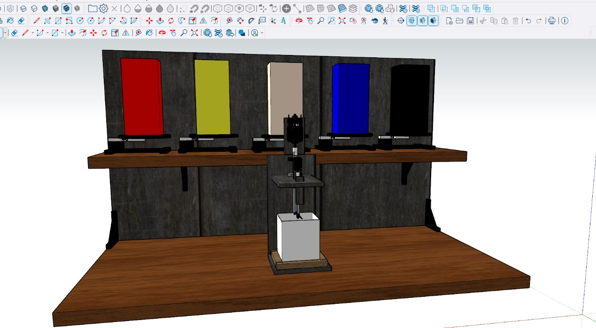

Se elabora el diagrama de flujo del sistema utilizando pseudocódigo, en el cual se indica la lógica prevista para la integración completa del sistema. Este diagrama representa la secuencia de operaciones que se ejecutarán durante el proceso de adquisición de datos de las galgas extensiométricas (por medio de los módulos HX711), la lectura de color mediante la cámara y la posterior codificación de los valores en el modelo CMYK, con el fin de obtener el color final en el recipiente de pintura.

# AVANCE 07-11-2025

Montaje de la estructura 

Se realizó el montaje de la estructura y la fabricación de los recipientes, los cuales estarán destinados a alojar las respectivas pinturas para el proceso de mezclado.

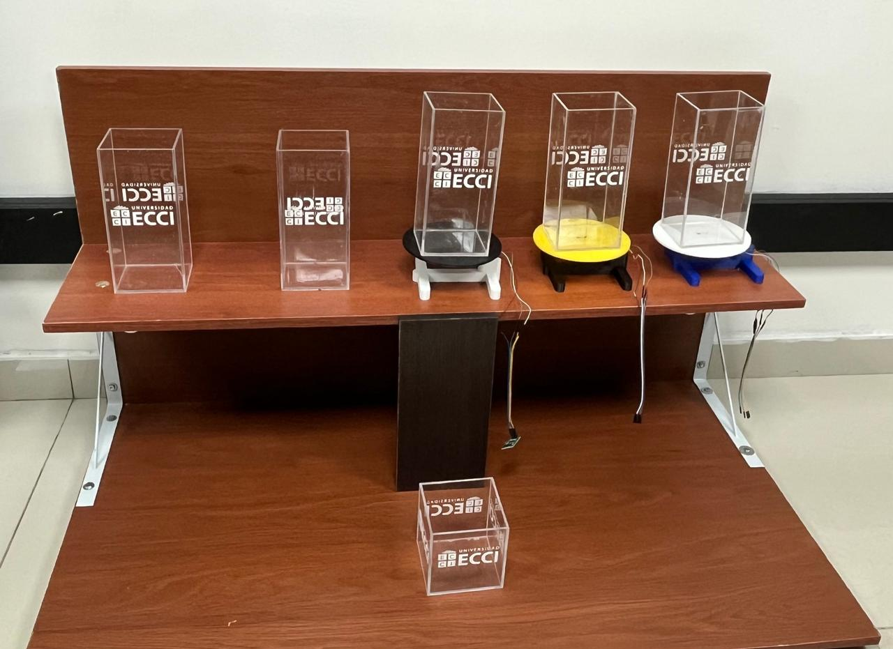

Durante la semana se realizó la integración de las cinco galgas extensiométricas con el módulo ESP32, dejando cada una debidamente calibrada para que puedan ser dispuestas en las pruebas finales.

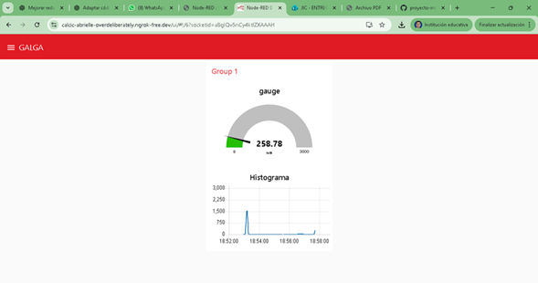

Igualmente, se realizaron los esquemas de conexión y visualización mediante Node-RED. En este caso, se dejaron configurados los bloques de medida y el histograma obtenido durante las pruebas, permitiendo una representación gráfica del comportamiento de las señales provenientes de las galgas.

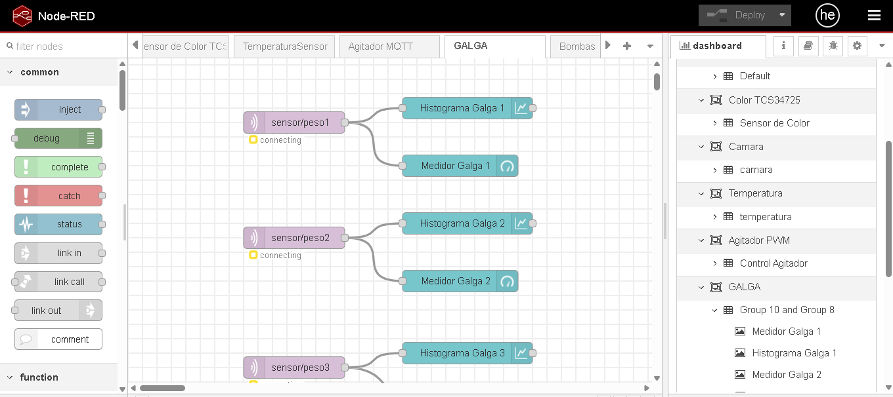

igualmente, se realizaron las visualizaciones en el Dashboard, permitiendo monitorear en tiempo real las lecturas de las cinco galgas extensiométricas.

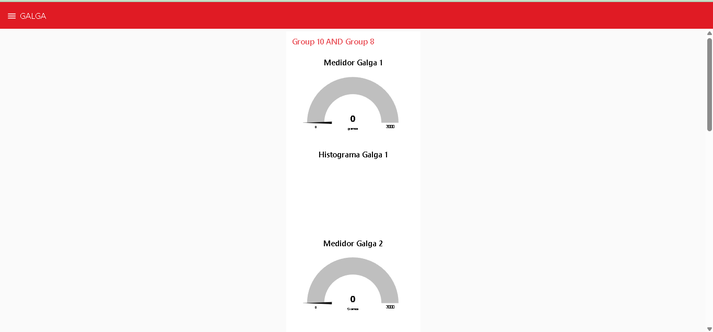

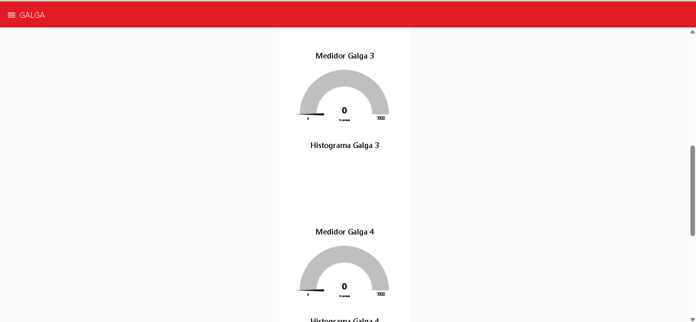

## AVANCE 14-11-2025

Durante el proceso se inició la instalación de las galgas sobre la estructura de madera. Conforme al diseño establecido, se efectuó el montaje de las bases de las galgas junto con su tornillería correspondiente, garantizando la correcta fijación y alineación de los elementos.

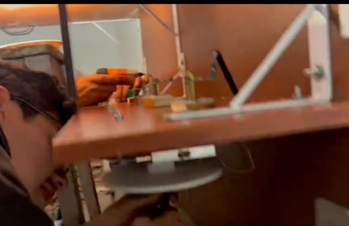

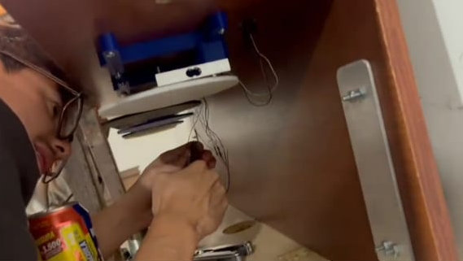

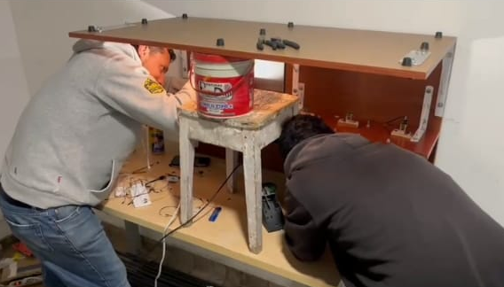

Una vez finalizado el montaje de las bases y de las galgas, se procedió con la instalación de los módulos HX711, junto con su respectivo cableado, asegurando las conexiones según las especificaciones técnicas del diseño

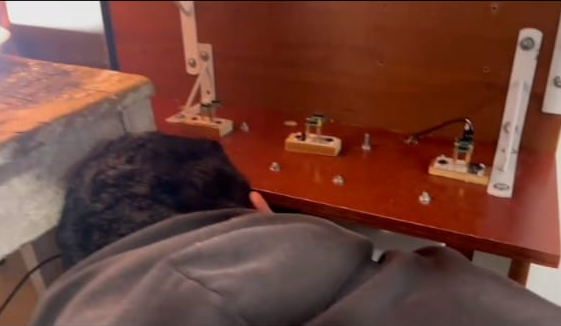

## Entrega a integradores 21/11/2025

Posterior a la realización del cableado y las conexiones, se efectuó nuevamente la validación del código, donde se evidenció la necesidad de reemplazar los pines 34 y 35 de la ESP32, debido a que dichos pines estaban generando fallas en la lectura de los datos.
En consecuencia, se optó por realizar el cambio de pines asignados, con el fin de garantizar la correcta adquisición de señales y proceder con las pruebas finales del sistema.

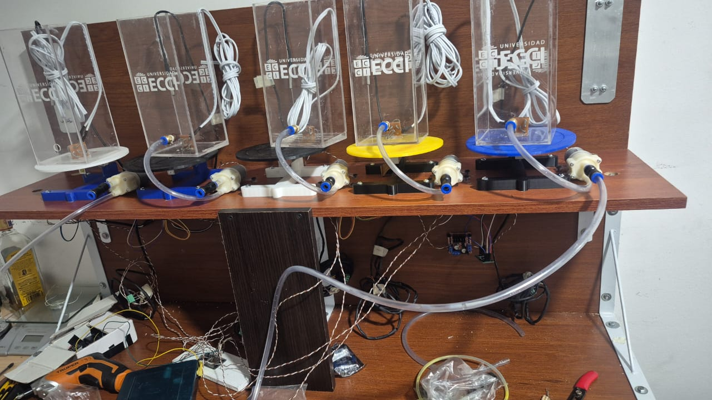

de esta manera se realiza la verificaciones de las lecturas y se realiza el ajuste de valores para la calibracion del sistema, El arreglo de las  GALGAS se hace en una lista de diccionarios en Python, donde cada diccionario representa la configuración individual de una galga (célula de carga) conectada a un módulo HX711.

Cada elemento contiene la información necesaria para:

Identificar los pines de conexión al ESP32

Definir el topic MQTT donde se publicará el peso

Establecer el valor de calibración (scale) para cada sensor

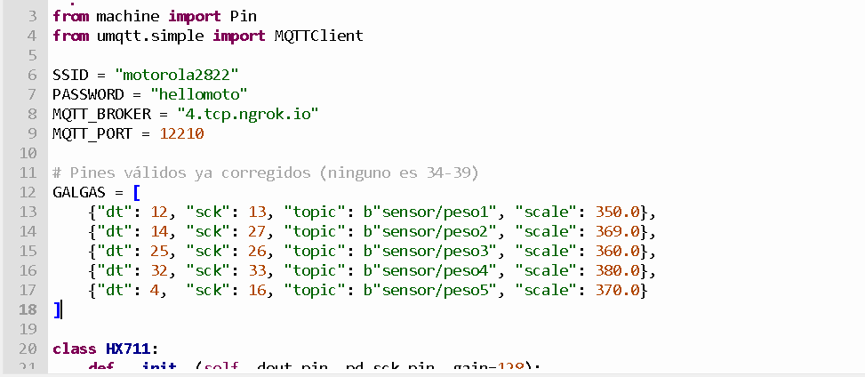

 Esta clase HX711 implementa su lectura manualmente usando pines GPIO del ESP32. Esto configura los pines del microcontrolador:

PD_SCK: pin OUT → genera pulsos de reloj
DOUT: pin IN → recibe los bits del HX711
Con PULL_UP se activa la resistencia interna.

El HX711 selecciona ganancia enviando pulsos adicionales después de la lectura. Como tambien genera valores iniciales como:

OFFSET: valor en cero después de hacer tare.

SCALE: factor de calibración.

Coloca PD_SCK en estado bajo (importante al inicio).

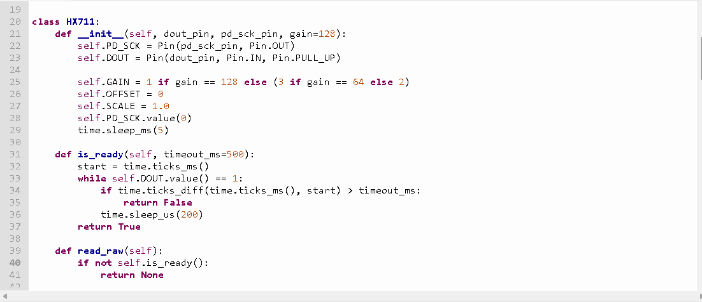

para la conexion en wifi usa funciones conectar_wifi() el cual Activa el WiFi del ESP32 e intenta conectarse usando SSID y PASSWORD.

y para en la funcion mqtt_connect(), Crea un cliente MQTT con el nombre ESP32_5GALGAS.luego intenta conectarse al broker configurado.

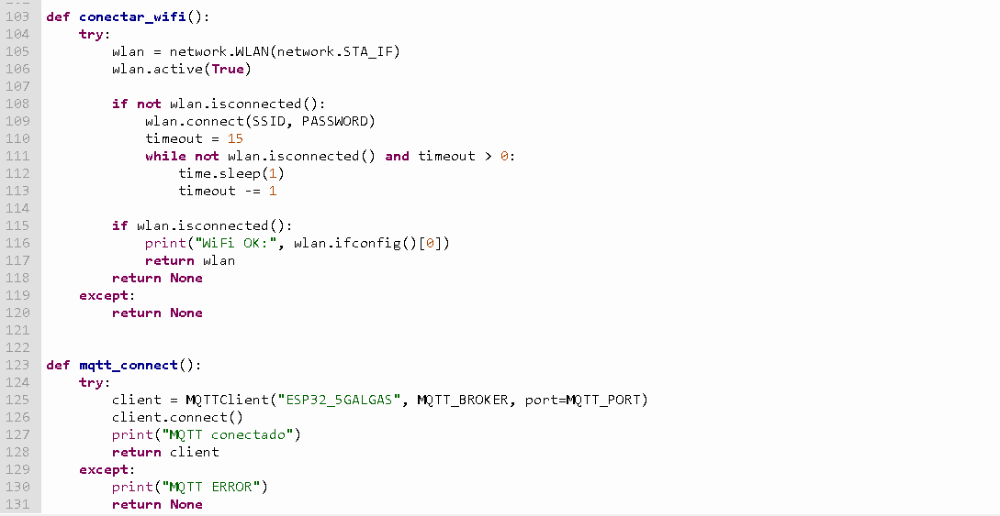

y finalizando sigue el main() el cual es la secuencia principal del programa:

el cual  Inicializa WiFi y MQTT, Llama conectar_wifi() → conecta MQTT.

Luego inicializa las galgas, Para cada configuración en GALGAS:
-Crea el objeto HX711.
-Realiza tare (poner en cero).
-Aplica el factor de escala.
-Guarda el sensor en la lista galgas.

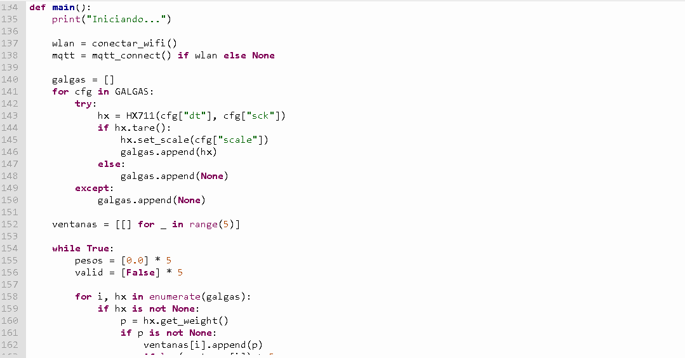

Con el equipo de integración se verificó que la información generada por las galgas llega correctamente a la interfaz gráfica en Node-RED. Como se observa, se realizó la implementación y visualización individual de cada galga, incluyendo su lectura inicial antes de ejecutar la tara y comenzar las mediciones. De esta manera, el sistema de galgas realiza las pruebas funcionales finales necesarias para su correcta integración con los demás sistemas del proyecto.

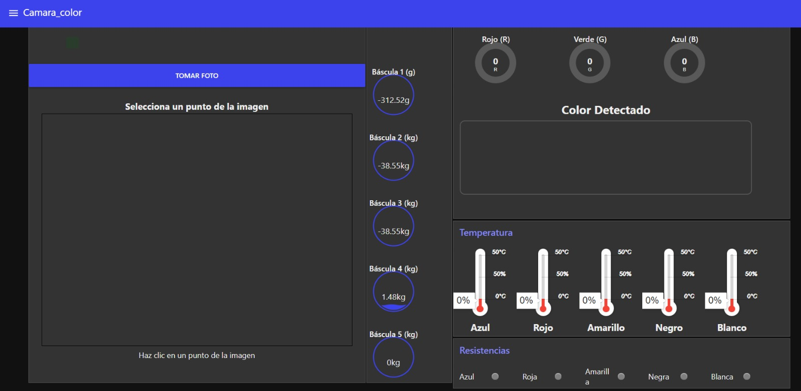

### 1. [Flujos](/G10/flujos/flows.json)

### 2. [Programación micropython](/G10/micropython/test.py)

