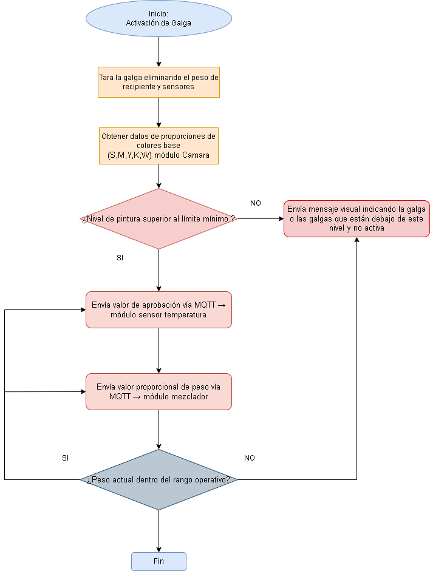
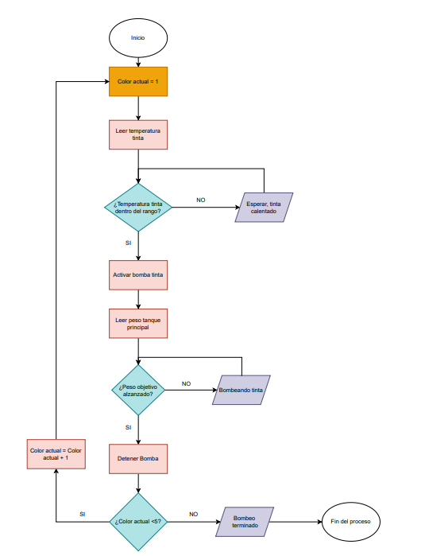

# Nombre de la etapa: control de bombas y unificacion de codigo  

## Integrantes

* [David Santiago Puentes Cárdenas — 99225](https://github.com/Monstertrox)
* [Juan David Arias Bojacá — 107394](https://github.com/juandariasb-ai)

---

## Introducción (Inicio del Sistema por Visión Artificial)

Todo el sistema inicia en una **Raspberry Pi**, donde una **cámara** captura la imagen del recipiente de pintura. A partir de esta imagen se realiza un **análisis de color**, obteniendo las proporciones **CMYKW (Cian, Magenta, Yellow, Black y White)**.

Una vez procesado el color:

1. La Raspberry convierte los valores de color en un **string** con formato:

   ```
   C:10 M:20 Y:5 K:3 W:2
   ```

2. Este string es enviado por **MQTT** hacia la **ESP32_2**, que es la encargada de **controlar las bombas, el agitador y la ejecución completa de la mezcla**.

Todo el código presentado en este documento corresponde exclusivamente a la **ESP32_2**, que recibe órdenes desde la Raspberry y ejecuta físicamente el proceso.

---

## Objetivo del Sistema

Controlar cinco bombas de diafragma mediante una **ESP32_2** que recibe recetas de mezcla en formato **CMYKW** por **MQTT**. El sistema convierte los porcentajes de color en **tiempos de activación**, verifica condiciones previas mediante **galgas de peso**, ejecuta las bombas de forma secuencial y finaliza con un proceso de **agitación automática**.

---

## Arquitectura del Sistema

### Componentes Principales

* Raspberry Pi con cámara para detección de color
* 2 ESP32 (control distribuido)
* 5 Bombas de diafragma controladas por PWM
* Galgas de peso para medición del nivel de pintura
* Motor agitador
* Comunicación MQTT

---

## Flujos del Sistema (Basados en Diagramas)

### 1. Flujo de Galgas (Control de Nivel de Pintura)

Este es el primer flujo que se ejecuta tras recibir el color desde la Raspberry.

<p align="center">
  
</p>


**Funcionamiento:**

1. Se activa la galga.
2. Se elimina el peso del recipiente y sensores (tara).
3. Se validan las proporciones CMYKW recibidas desde la cámara.
4. Se verifica que el nivel de pintura sea superior al mínimo.
5. Si el nivel NO es suficiente → se envía un mensaje visual y se bloquea el proceso.
6. Si el nivel SÍ es suficiente → se habilita el envío de datos hacia el módulo de bombas.

Este comportamiento se representa en el código mediante la validación indirecta antes de activar las bombas.

---

### 2. Flujo del Motor Agitador

<p align="center">
  
</p>

**Funcionamiento:**

1. Desactivación inicial de válvulas.
2. Activación del motor 1 para bajar el aspa.
3. Activación del motor 2 para agitar la pintura.
4. Desactivación del motor 2.
5. Activación del motor 1 para subir el aspa.

En el código este proceso se ejecuta mediante la función:

```python
def run_agitador():
```

Que activa el pin del agitador durante **10 segundos**.

---

### 3. Flujo de Bombas de Pintura

<p align="center">
  
</p>


**Funcionamiento:**

1. Se define el color actual.
2. Se lee la temperatura de la tinta.
3. Se verifica que esté dentro del rango permitido.
4. Se activan las bombas.
5. Se mide el peso del tanque principal.
6. Cuando se alcanza el peso objetivo, se detiene la bomba.
7. Se repite el proceso hasta completar los 5 colores.

---

## Descripción Detallada del Código (ESP32_2)

### 1. Configuración de Red WiFi

```python
WIFI_SSID = "Chucho"
WIFI_PASS = "Chucho123"
```

La función `conectar_wifi()` establece la conexión de la ESP32_2 a la red para permitir la comunicación MQTT.

---

### 2. Configuración MQTT

```python
MQTT_BROKER     = "192.168.94.216"
MQTT_PORT       = 1883
MQTT_CLIENT_ID  = b"ESP32_BOMBAS"
MQTT_TOPIC_CMYK = b"esp/out"
```

Permite recibir las recetas CMYKW provenientes desde la Raspberry.

---

### 3. Configuración de Bombas

```python
PWM_PINS   = [15, 2, 4, 16, 17]
DIR1_PINS  = [23, 19, 18, 5, 4]
DIR2_PINS  = [22, 21, 32, 33, 25]

PWM_FREQ = 1000
PWM_GLOBAL = 70

TIEMPOS_BOMBAS_MAX = [5, 5, 5, 5, 5]
MAX_TOTAL_PERCENT = 40
```

* Control PWM por bomba
* Límite de potencia al 70%
* Tiempo máximo de activación: 5 segundos por bomba
* Límite total CMYKW: 40%

---

### 4. Sistema de Agitación

```python
AGITADOR_PIN = 26
AGITATOR_TIME_S = 10
```

Encargado de homogenizar la pintura luego de terminar la succión de todos los colores.

---

### 5. Estados Globales

```python
tiempos_bombas_receta = [0.0]*5
receta_lista = False
mezcla_en_progreso = False
temp_ok = [True]*5
flags = [0]*5
```

Permiten controlar correctamente la ejecución de la receta.

---

### 6. Procesamiento de Recetas CMYKW

```python
parse_cmykw()
cmykw_to_tiempos()
```

Convierte el string recibido por MQTT en tiempos reales de activación de las bombas.

---

### 7. Control de Bombas

```python
def ejecutar_bomba_tiempo(i, t):
```

* Activa cada bomba según su tiempo
* Permite frenar la bomba con L298N
* Supervisa el sistema mientras corre

---

### 8. Callback MQTT

```python
def mqtt_callback(topic, msg):
```

Procesa automáticamente los valores recibidos desde la Raspberry para iniciar una nueva receta.

---

### 9. Flujo Principal del Programa

```python
def main():
```

1. Conecta WiFi
2. Conecta MQTT
3. Espera receta
4. Ejecuta bombas
5. Activa agitador
6. Finaliza mezcla

---

## Formato de Mensajes MQTT

### Recetas CMYKW

* **Topic**: `esp/out`
* **Formato**: `C:10 M:20 Y:5 K:3 W:2`

---

## Secuencia General de Operación

1. Raspberry detecta color
2. Envía receta por MQTT
3. Galgas validan nivel
4. ESP32_2 ejecuta bombas
5. Se activa agitador
6. Sistema queda listo para una nueva mezcla

---

## Características de Seguridad

* Límite máximo de mezcla: 40%
* Frenado activo de bombas
* Agitación sólo cuando todas las bombas terminan
* Protección por PWM

---

## Integración con Node-RED

* Dashboard para envío de recetas CMYKW
* Visualización de proceso
* Control remoto completo del sistema

---

#  Modulo fisico, Node-Red y correcciones de codigo 

Este módulo de control implementado en **MicroPython sobre la ESP32_2** se encarga de ejecutar la dosificación de pintura mediante **bombas controladas estrictamente por tiempo**, a partir de una **receta enviada desde Node-RED por medio de MQTT en formato string**.

A diferencia de la propuesta inicial del proyecto integrador, donde se contemplaba el uso de **galgas de peso para medición directa**, estas no pudieron cumplir correctamente su función debido a la **falta de pines disponibles en la ESP32 causada por un corte en el montaje físico**. Por esta razón, se tomó la decisión de migrar el sistema a un modelo de **control completamente temporal**, el cual garantiza estabilidad, repetibilidad y correcta sincronización de todo el proceso.

---

## Montaje Físico del Sistema

<p align="center">
  
</p>

<p align="center">
  
</p>


El montaje físico del sistema se realizó bajo los siguientes principios de diseño:

* Todas las **bombas de succión fueron conectadas mediante mangueras plásticas**.
* Las **cinco mangueras fueron cortadas exactamente a la misma distancia**, con el propósito de:

  * Evitar retardos de succión entre colores.
  * Garantizar igualdad en el caudal de todos los pigmentos.
* La **ESP32 se conectó a un puente H**, el cual se encarga de suministrar:

  * Las señales de **dirección (IN1, IN2)** para cada motor.
  * La señal de **habilitación mediante PWM (ENA)** para el control de velocidad y activación.
* Este esquema de control se refleja directamente en el código mediante estructuras como:

```python
motor['in1']
motor['in2']
motor['ena'].duty(valor)
```

Este diseño permitió mantener un control seguro y estable de cada bomba a pesar de las limitaciones físicas del montaje y de la imposibilidad de integrar correctamente las galgas.

---

## Arquitectura de Comunicación y Lógica de Control

El sistema trabaja bajo el siguiente flujo de operación:

1. **Node-RED genera la receta de mezcla** mediante la selección de porcentajes por color.
2. La receta se envía por **MQTT en formato string**, por ejemplo:

```
C:20 M:30 Y:10 K:30 W:10
```

3. La ESP32 recibe el mensaje en el tópico:

```python
MQTT_TOPIC_IN = b"esp/out"
```

4. El string recibido es **parseado y convertido en un diccionario de tiempos de succión** mediante la función `parse_mqtt_message()`:

```python
{'C': 5.0, 'M': 7.5, 'Y': 2.5, 'K': 7.5, 'W': 2.5}
```

5. Cada motor se activa durante el tiempo proporcional a su porcentaje utilizando la función `motor_succionar()`.
6. Al finalizar la dosificación de todas las bombas, se ejecuta automáticamente la **secuencia del elevador y agitador** mediante la función `Elevador_agitador()`.

Este modelo de control permite un comportamiento totalmente determinístico, sincronizado y repetible.

---

## Interfaz de Node-RED

<p align="center">
  
</p>

La interfaz de **Node-RED** cumple dos funciones principales:

* Permitir al usuario **seleccionar el color y el porcentaje de cada componente de la mezcla**.
* **Visualizar en tiempo real cuáles bombas se encuentran en funcionamiento** mediante indicadores de estado.

El flujo de Node-RED, representado en la imagen del sistema:

```
Intento_ Node_red_final.jpeg
```

se encarga de:

* Enviar la receta en formato string hacia la ESP32 por medio de MQTT.
* Recibir el estado de cada bomba (`ON` / `OFF`).
* Mostrar gráficamente cuáles bombas se encuentran activas.

Este módulo garantiza una supervisión clara y segura del proceso completo de dosificación.

---

## Configuración de Control y Red

En el código se definen las siguientes constantes principales:

```python
TIEMPO_100_PORCIENTO = 25
MOTOR_PWM_FREQ = 1000
SEGUNDOS_ENTRE_MOTORES = 2
```

El **100% de la mezcla corresponde a 25 segundos de succión total**. Cada porcentaje recibido se convierte en tiempo mediante la relación:

```
Tiempo = (Porcentaje / 100) * 25 segundos
```

La configuración de red MQTT se define de la siguiente manera:

```python
MQTT_BROKER = "192.168.59.216"
MQTT_PORT = 1883
MQTT_CLIENT_ID = b"ESP32_BOMBAS"
MQTT_TOPIC_IN = b"esp/out"
```

Además, se utilizan tópicos adicionales para visualizar el estado del sistema:

```python
TOPIC_ESTADO_BOMBAS = b"in/esp2/bombas/estado"
TOPIC_AGITADOR = b"agitador/estado"
TOPIC_ELEVADOR = b"elevador/estado"
```

---

## Definición de Bombas y Pines de Control

Las bombas se encuentran definidas por color y pines de control de la siguiente forma:

```python
COLORES_MOTORES = [
    ("CIAN", 26, 27, 25, 'C'),
    ("MAGENTA", 32, 33, 23, 'M'),
    ("YELLOW", 13, 19, 14, 'Y'),
    ("BLACK", 21, 4, 5, 'K'),
    ("WHITE", 12, 22, 2, 'W'),
]
```

Cada motor queda asociado a:

* Dos pines de dirección (IN1, IN2).
* Un pin de habilitación PWM (ENA).
* Una clave corta que se utiliza para interpretar la receta (`C, M, Y, K, W`).

---

## Control de Bombas por Tiempo

En este sistema, el control de las bombas se realiza exclusivamente por **tiempo de activación**, no por peso. Cada motor:

* Se activa con una dirección fija.
* Se habilita mediante PWM.
* Permanece activo durante el tiempo calculado desde el porcentaje recibido.

Entre cada activación se aplica una **pausa de seguridad**:

```python
SEGUNDOS_ENTRE_MOTORES = 2
```

Esto evita sobrecorrientes, activaciones simultáneas y errores de sincronización.

---

## Secuencia Final: Elevador y Agitador

Una vez finalizada la dosificación de las cinco bombas, el sistema ejecuta automáticamente una secuencia de tres etapas:

1. **Bajada del elevador**.
2. **Agitación del tanque**.
3. **Subida del elevador**.

Este proceso se ejecuta mediante la función `Elevador_agitador()` y es reportado por MQTT a través de los tópicos:

```python
TOPIC_ELEVADOR = b"elevador/estado"
TOPIC_AGITADOR = b"agitador/estado"
```

Este proceso garantiza una correcta homogeneización de la mezcla final antes de la descarga del producto.

---

## Justificación del Control por Tiempo

El cambio de un sistema basado en galgas a uno basado en control temporal se debió a las siguientes razones técnicas:

* Limitación de pines disponibles por un corte en el montaje físico.
* Imposibilidad de adquirir correctamente las señales de las galgas.
* Necesidad de asegurar la continuidad del proyecto integrador.

El control por tiempo ofreció las siguientes ventajas:

* Mayor estabilidad de funcionamiento.
* Repetibilidad del proceso.
* Mayor facilidad de implementación.
* Eliminación del ruido y la incertidumbre en la medición.

Por estas razones, esta solución fue adoptada como **modelo definitivo de control del sistema**.

## Conclusiones

* Este sistema integra visión artificial, control de motores, pesaje, automatización y comunicación IoT mediante MQTT para lograr un proceso de mezcla de pintura completamente automatizado, seguro, escalable y controlable desde red.

* El uso de comunicación MQTT permitió establecer un canal de transmisión de datos robusto, ligero y confiable entre la interfaz de supervisión (Node-RED) y el sistema embebido basado en ESP32, garantizando la correcta recepción de los setpoints de mezcla y el monitoreo en tiempo real del estado de cada bomba.

* La implementación del control por tiempo permitió resolver de forma eficiente las limitaciones presentadas por la falta de pines disponibles para el uso de galgas, asegurando la continuidad del proyecto sin comprometer la estabilidad del proceso. Este enfoque demostró ser una alternativa confiable, repetible y de fácil calibración.

* El diseño del montaje físico, con todas las mangueras a igual longitud y el uso de un puente H para la activación de las bombas, permitió garantizar un comportamiento homogéneo del sistema, evitando retrasos de succión y asegurando una dosificación proporcional entre los diferentes pigmentos.

* El sistema demostró un alto grado de integración entre hardware y software, permitiendo sincronizar de manera precisa la dosificación de bombas, la ejecución del agitador y el control del elevador, lo que garantiza una mezcla final homogénea.

* Finalmente, este desarrollo valida la viabilidad de implementar sistemas de automatización industrial a bajo costo utilizando microcontroladores, herramientas de software libre e infraestructura de comunicación IoT, lo cual resulta altamente relevante para aplicaciones de control de procesos, manufactura flexible y prototipado industrial.

